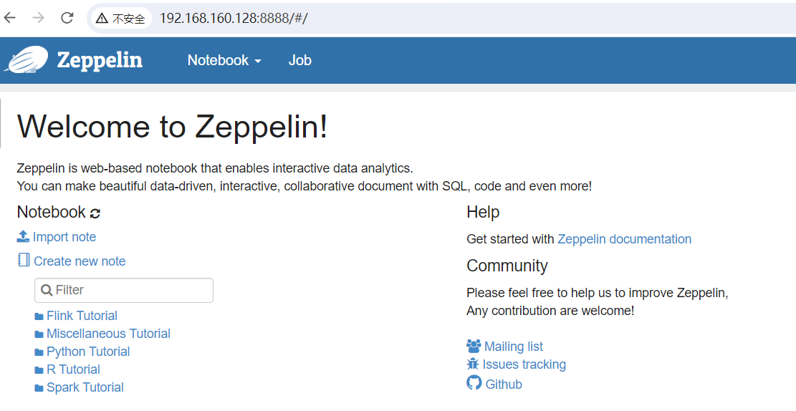
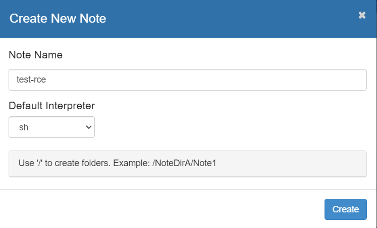
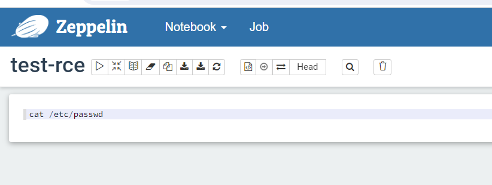

# Apache Zeppelin 解释器sh命令执行漏洞(CVE-2024-31861)

​	Apache Zeppelin是美国阿帕奇（Apache）基金会的一款基于Web的开源笔记本应用程序。该程序支持交互式数据分析和协作文档。

​	近日官方发布更新披露 CVE-2024-31861 Apache Zeppelin hell 代码注入漏洞，攻击者可利用Zeppelin 中的shell功能执行任意命令。升级后官方默认禁止shell interpreter，该漏洞的CVSS评分为8.9 Apache Zeppelin 安装时默认没有设置用户名密码，所以该漏洞也比较容易利用。

官网项目地址https://github.com/apache/zeppelin/releases

参考链接：

- https://nvd.nist.gov/vuln/detail/CVE-2024-31861

**影响版本**

0.10.1 <= Apache Zeppelin < 0.11.1

## 漏洞环境

执行如下命令启动一个zeppelin:0.10.1：

```
docker run -d --name zeppelin0.9 -p 8888:8080 apache/zeppelin:0.10.1
```

服务启动后，可访问`http://your-ip:8888/`将看到zeppelin界面




## 漏洞复现

1. 点击Notebook-->Create new note 选择Interpreter 为sh



2. 在输入框中填写你想执行的命令

   

3. 点击运行

   