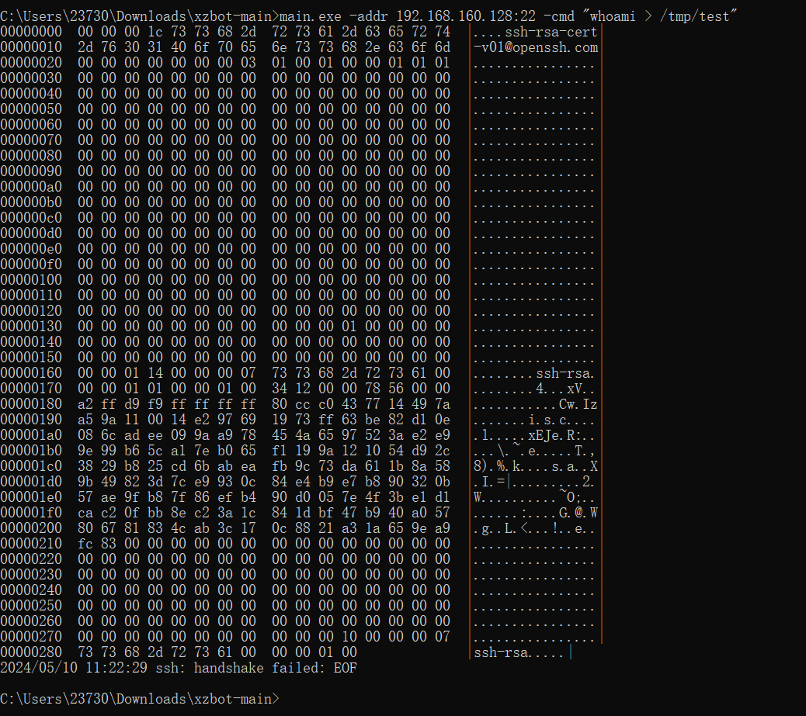
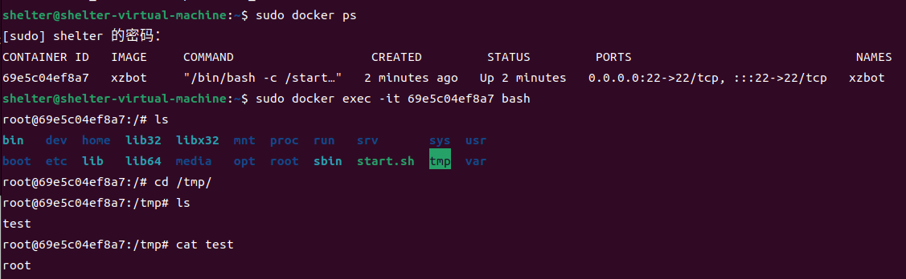

# **OpenSSH** xz/liblzma  后门程序 RCE CVE-2024-3094 

​	xz是几乎存在于所有Linux发行版中的通用数据压缩格式，流行的Linux压缩工具XZ Utils被发现存在投毒供应链攻击，从 5.6.0 版本开始，xz 的上游 tarball 中发现了恶意代码。通过一系列复杂的混淆，liblzma 构建过程从源代码中存在的伪装测试文件中提取预构建的目标文件，然后使用该文件修改 liblzma 代码中的特定函数。这会产生一个修改后的 liblzma 库，任何链接到该库的软件都可以使用该库，拦截并修改与该库的数据交互。

**影响版本** 影响5.6.0和5.6.1版本，CVSS评分10分.


参考连接

- https://mp.weixin.qq.com/s/Hmvda8mcTasyEmAQHBO7aw
- https://mp.weixin.qq.com/s/XY7hq9Li5VDfK-TfmRL9Cw
- https://cve.mitre.org/cgi-bin/cvename.cgi?name=CVE-2024-3094
- https://github.com/amlweems/xzbo


## 漏洞环境

执行如下命令启动漏洞环境

```
docker build -t xzbot .
docker run -p 22:22 --name  xzbot xzbot
```

## 漏洞复现

1，下载exphttps://github.com/amlweems/xzbot，使用go语言进行编译

```
go build  main.go
```

2，发送如下命令



3，打开容器镜像验证rce的执行




