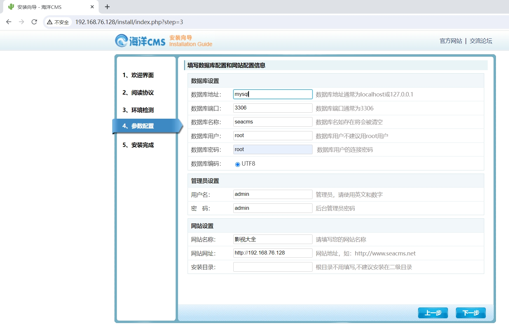
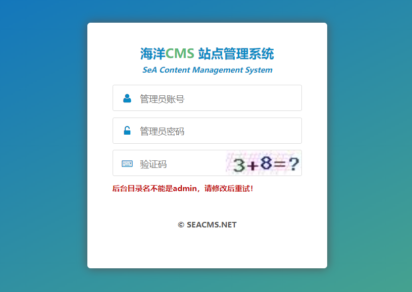
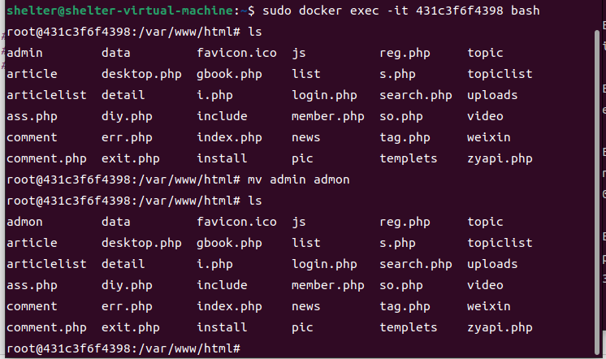
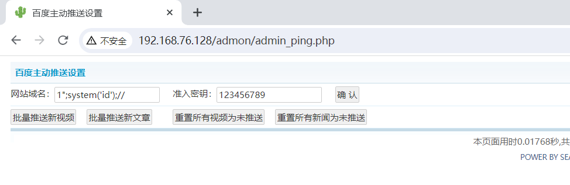
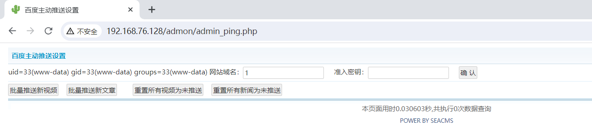
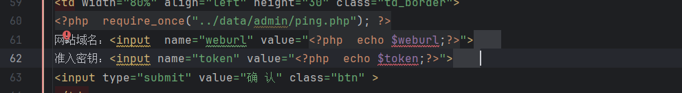
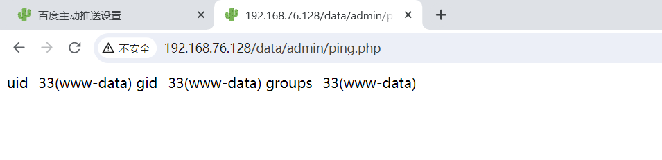
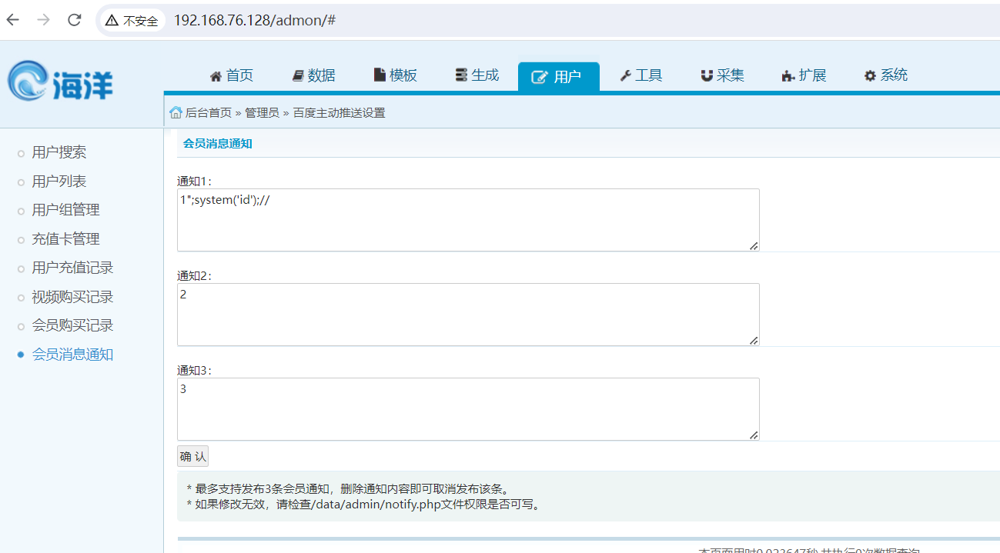
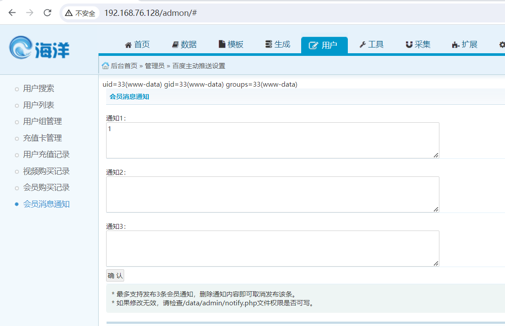
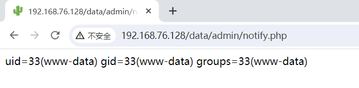

# SeaCMS v12.9 后台远程代码执行漏洞.md

​	SeaCMS 是一款用 PHP 编写的免费开源网站内容管理系统。该系统主要用于管理视频点播资源。
​	SeaCMS 12.9版本存在远程代码执行漏洞，该漏洞是由于admin_ping.php admin_notify.php等接口不做任何处理就直接将用户输入的数据拼接写入ping.php notify.php中导致的，未经过身份验证的攻击者可利用该漏洞执行任意命令，获取系统权限。

**影响版本**：SeaCMS12.9

SeaCMS地址：https://www.seacms.net/

参考链接

- https://github.com/pysnow1/vul_discovery/blob/main/SeaCMS/SeaCMS%20v12.9%20admin_ping.php%20RCE.md
- https://github.com/XiLitter/CMS_vulnerability-discovery/blob/main/SeaCMS_v.12.9.md

## 漏洞环境

执行如下命令启动一个SeaCMS-v12.9-web

```
docker compose up 
```

服务启动后，访问`http://your-ip:80/`即可跳转到到SeaCMS安装向导界面。





根据要求，进入容器将admin目录改为admon

```bash
sudo docker ps

sudo docker exec -it 431c3f6f4398 bash

mv admin admon
```



## 漏洞复现

1，/admon登录后台获取cookie 发送payload



点击确认，等待保存成功



我们还可以直接访问ping.php查看回显





2，来到会员消息通知，输入payload



点击确认 便可看到回显



也可直接访问`/data/admin/notify.php` 查看回显

