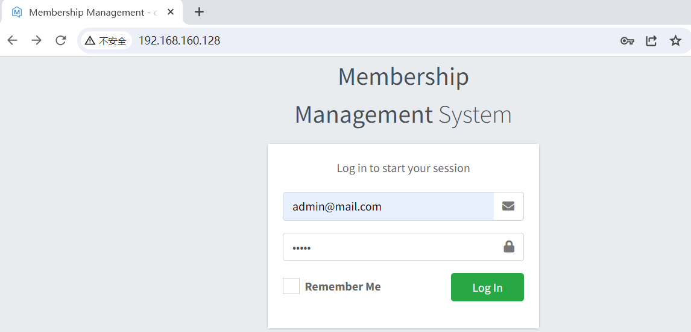
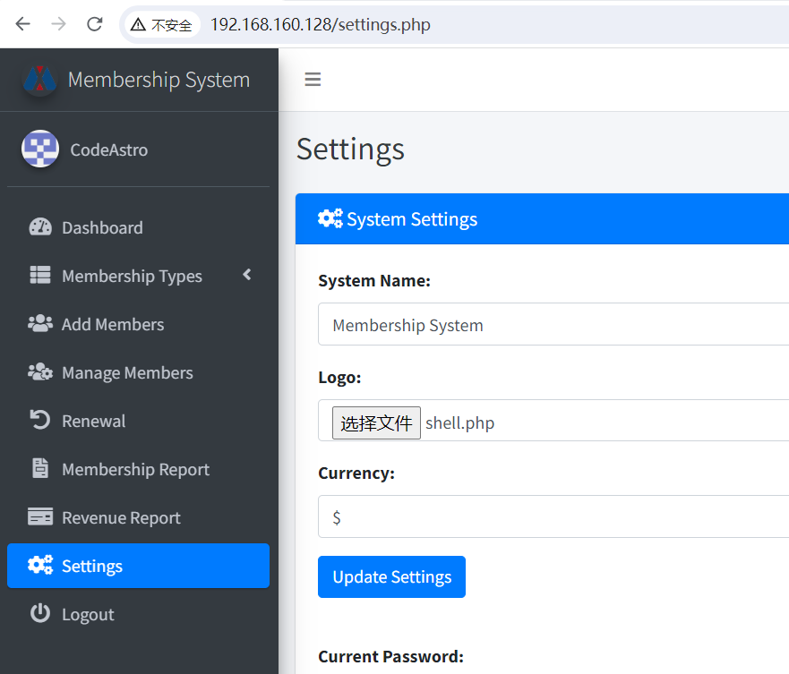
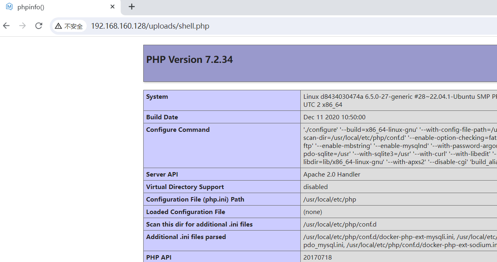

# Membership Management System-不受限制的文件上传到RCE漏洞(CVE-2024-25869)

​	一个基于会员管理系统的功能齐全的项目，使用 PHP 语言和 MySQL 数据库。特别是，这个基于 PHP 的会员系统提供了一个包罗万象的套件。它熟练地处理会员类型、会员、收入的流程，并简化会员卡流程。它具有多种功能，允许用户管理和跟踪会员记录。

​	此漏洞的存在使未经身份验证的攻击者能够将.php文件上载到Web服务器，并在运行应用程序的用户的权限下执行代码。

源码地址https://codeastro.com/membership-management-system-in-php-with-source-code/

参考链接：

- https://github.com/0xQRx/VulnerabilityResearch/blob/master/2024/MembershipManagementSystem-Unrestricted_Fileupload.md

## 漏洞环境


执行如下命令启动一个Membership -web：

```
docker compose up -d
```

环境启动后，访问`http://your-ip:80`即可跳转到Membership 登录页面


## 漏洞复现

1. 使用用户及密码 admin@mail.com:admin 登录系统



2. 进入设置页面上传logo 为shell.php，点击Updata Settings



3. 访问地址 /uploads/shell.php


