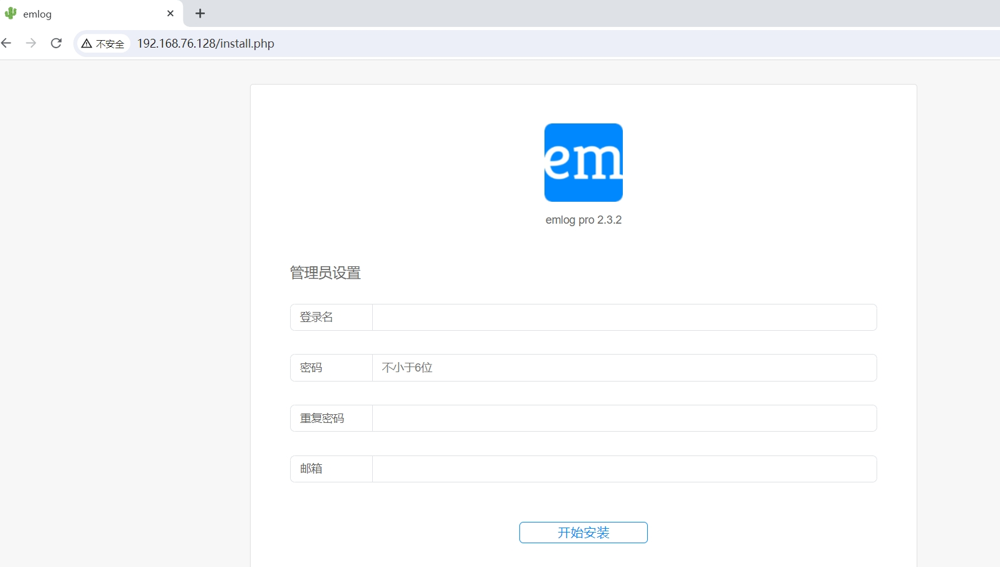
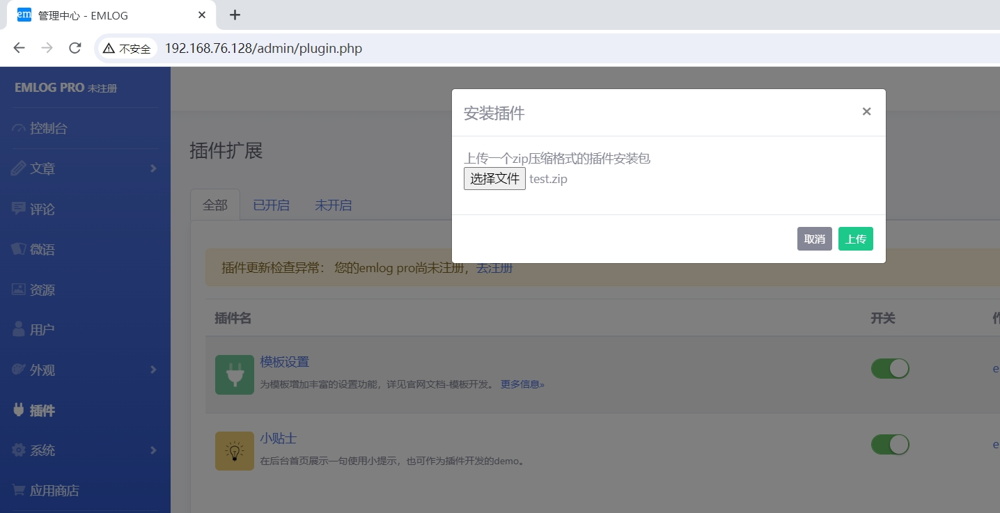
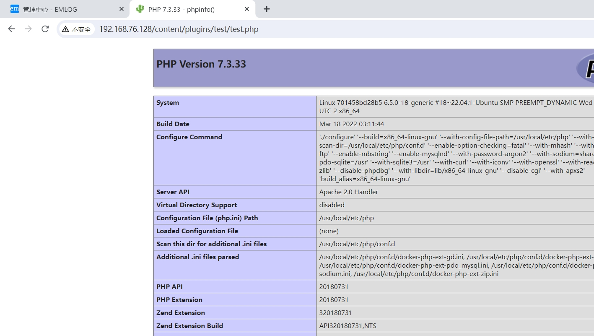

#  emlog后台插件文件上传漏洞

emlog是一个基于PHP和MYSQL的快速稳定的轻量级博客及CMS建站系统。在emlog pro项目中，有一个可以上传的zip的接口在admin/views/plugin.php，解压之后并没有对内容进行任何的过滤和分析，这样就可以用php上传一个压缩文件，通过解压上传到服务器，从而getshell。

**影响版本**：emlog pro 2.3.x

**项目地址**：https://github.com/emlog/emlog

参考链接：

- https://github.com/Myanemo/emlogpro/blob/main/emlog%20pro2.3.2%20File%20upload%20to%20getshell.md

## 漏洞环境

执行如下命令启动一个mlog-pro-v2.3.2-web服务：

```
docker compose up 
```

服务启动后，访问`http://your-ip:80/`即可跳转到到mlog安装向导界面。



## 漏洞复现

1.登录后台，点击“插件-安装插件-选择文件”上传制作好的zip文件。



2.成功上传插件后访问`http://192.168.76.128/content/plugins/test/test.php`

