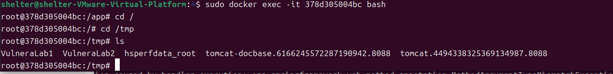

# xxl-job v2.0.2  Hessian2反序列化漏洞

XXL-JOB在2.0.2及以下版本中的接口/xxl-job-admin/api 存在未授权访问漏洞，该接口会进行Hessian2反序列化操作，导致存在Hessian2反序列化漏洞从而RCE。

项目开源地址：https://github.com/xuxueli/xxl-job

参考链接：

## 环境搭建

执行如下命令启动一个包含漏洞的xxl-job v2.0.2环境：

```
docker compose up -d
```


## 漏洞复现

恶意序列化执行类示例


burp向/xxl-job-admin/api POST发包   body体为 SwingLazyValue.hessian文件（注意要raw格式）


发送序列化数据发送后进入docker内验证命令执行的结果。

